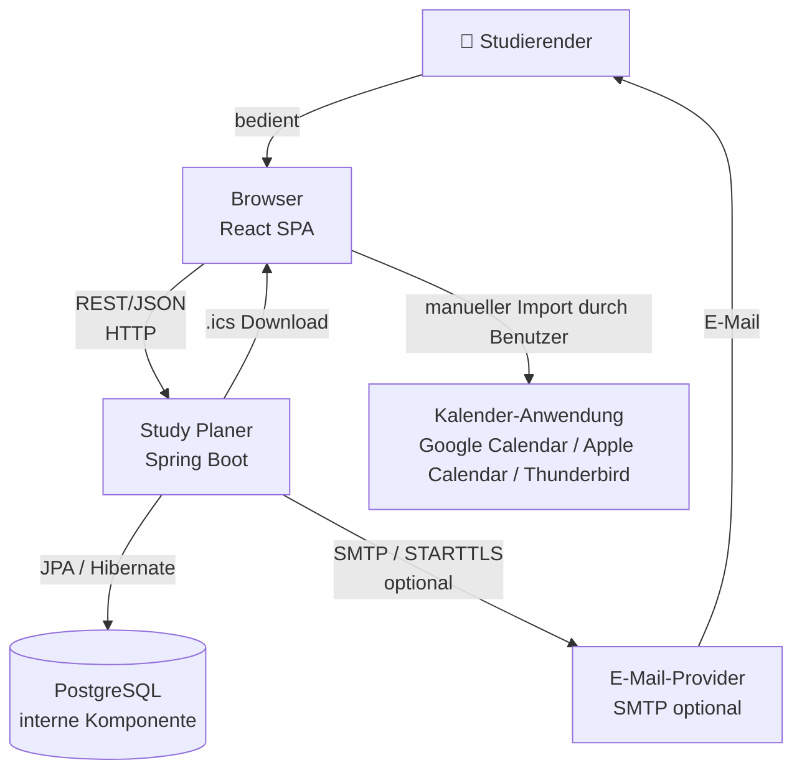

# 3 — Kontextabgrenzung

Dieses Kapitel beschreibt die Grenze des Study Planers zu seiner Umgebung.
Es wird zwischen dem eigentlichen System, seinen Benutzern und externen
Nachbarsystemen unterschieden.

## 3.1 Systemgrenze

Der Study Planer umfasst die folgenden internen Bestandteile:

- React-basierte Weboberfläche
- Spring-Boot-Backend
- Geschäftslogik für Aufgabenverwaltung, Lernplan, Fortschritt und Erinnerungen
- REST-API
- Persistenzschicht
- PostgreSQL-Datenbank
- Generierung von iCalendar-Dateien

Die PostgreSQL-Datenbank wird als interne Komponente des Study Planers
betrachtet und ist daher kein Nachbarsystem.

## 3.2 Systemkontext

Das System interagiert mit einem primären Benutzer und zwei externen
Nachbarsystemen:

| Externes Element | Rolle | Schnittstelle |
|------------------|-------|---------------|
| Studierender | Primärer Benutzer des Study Planers | Browser / Weboberfläche |
| E-Mail-Provider | Versand optionaler Erinnerungs-E-Mails | SMTP mit STARTTLS |
| Kalender-Anwendung | Import der exportierten Aufgaben | iCalendar (`.ics`) |

### Kontextdiagramm

## 3.3 Interne und externe Kommunikation

### Browser ↔ Backend

Die Kommunikation zwischen der React-SPA und dem Spring-Boot-Backend erfolgt
über eine versionierte REST-API.

Basis-URL in der lokalen Entwicklungsumgebung:

`http://localhost:8080/api/v1`

Die Kommunikation verwendet JSON. Geschützte Endpunkte werden über einen
JWT im HTTP-Header `Authorization: Bearer <token>` authentifiziert.

### Backend ↔ PostgreSQL

Das Backend greift über Spring Data JPA und Hibernate auf die PostgreSQL-
Datenbank zu. Die Datenbank gehört zur Systemgrenze und wird gemeinsam mit
dem Backend über Docker Compose betrieben.

### Backend ↔ E-Mail-Provider

Der E-Mail-Versand ist optional. Das Backend kommuniziert über SMTP mit
STARTTLS mit einem vom Betreiber konfigurierten E-Mail-Provider.

Ist kein SMTP-Provider konfiguriert, wird der E-Mail-Kanal deaktiviert. Der
Normalbetrieb des Study Planers wird dadurch nicht blockiert.

### Study Planer ↔ Kalender-Anwendung

Der Study Planer kommuniziert nicht direkt mit einer Kalender-API.

Das Backend erzeugt eine RFC-5545-konforme `.ics`-Datei. Diese wird über den
Browser heruntergeladen und anschließend vom Benutzer in eine unterstützte
Kalender-Anwendung importiert.

Unterstützt werden unter anderem Google Calendar, Apple Calendar und
Mozilla Thunderbird.

## 3.4 Abgrenzung außerhalb des Systems

Folgende Funktionen und Systeme gehören nicht zur Systemgrenze:

- Kollaborative Funktionen wie Gruppen, geteilte Aufgaben oder gemeinsame Lernpläne
- Lernmanagementsysteme wie Moodle
- Prüfungsanmeldung und institutionelle Notenverwaltung
- Kommunikation zwischen Studierenden
- native iOS- oder Android-Anwendungen
- direkte Integration mit Kalender-APIs
- Migration von Daten aus einem Vorgängersystem

Diese Punkte sind gemäß der Spezifikation außerhalb des Projekt-Scopes.
