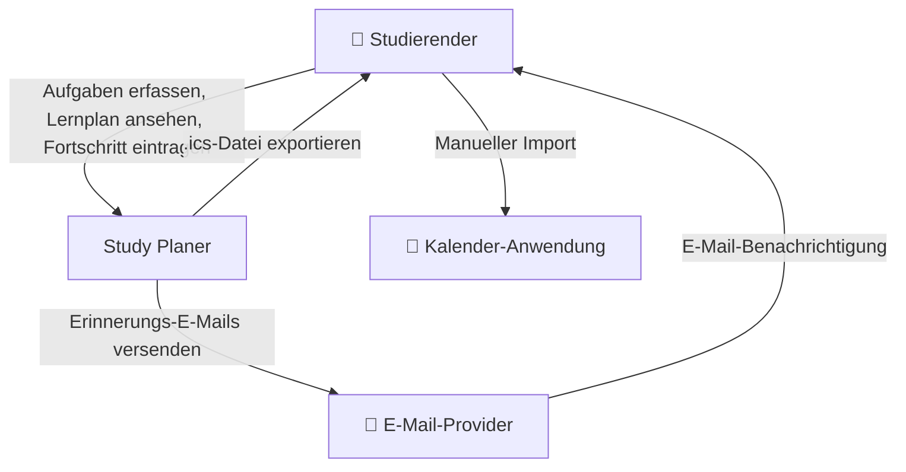
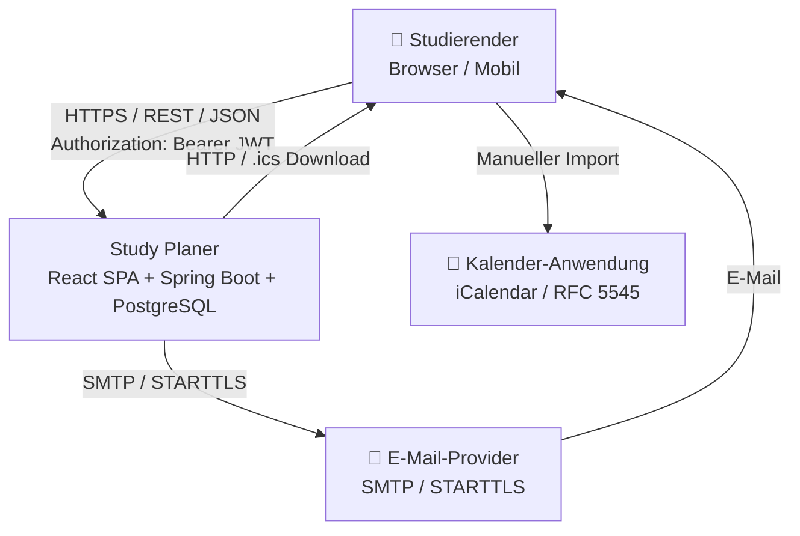

# 3 — Kontextabgrenzung

Dieses Kapitel beschreibt die Grenze des Study Planers zu seiner Umgebung.  
Das System wird als Blackbox betrachtet. Interne Komponenten (Frontend,
Backend, Datenbank) werden erst in Kapitel 5 und 7 detailliert.

## 3.1 Fachlicher Kontext

Der Study Planer ist eine webbasierte Einzelnutzer-Anwendung zur Planung
von Prüfungen, Abgaben und Lernzielen.

| Nachbarsystem | Beschreibung | Datenfluss |
|---------------|-------------|------------|
| **Studierender** | Primärer Nutzer; bedient die Anwendung über einen Browser | Erfasst Aufgaben, liest Lernplan, trägt Fortschritt ein |
| **E-Mail-Provider** | Externer Dienst für den optionalen Versand von Erinnerungs-E-Mails | System → Provider: E-Mail mit Erinnerungsinhalt; Provider → Nutzer: Zustellung |
| **Kalender-Anwendung** | Lokale Kalender-App des Nutzers (z. B. Google Calendar, Apple Calendar) | System → Nutzer: `.ics`-Datei; Nutzer → Kalender: manueller Import |

## 3.2 Technischer Kontext

Die fachliche Darstellung aus 3.1 wird hier um die technischen Protokolle
und Schnittstellen ergänzt. Das System selbst bleibt als Blackbox abgebildet.

| Nachbarsystem | Technische Schnittstelle | Protokoll / Format |
|---------------|-------------------------|-------------------|
| **Studierender** | REST-API des Backends | HTTPS, JSON, JWT (`Authorization: Bearer`) |
| **E-Mail-Provider** | SMTP-Schnittstelle | SMTP mit STARTTLS; Konfiguration über Umgebungsvariablen |
| **Kalender-Anwendung** | iCalendar-Datei | RFC 5545 (`.ics`); Download über Browser |

Die interne Kommunikation zwischen Frontend, Backend und Datenbank wird
in Kapitel 7 (Verteilungssicht) beschrieben.

## 3.3 Abgrenzung außerhalb des Systems

Folgende Funktionen und Systeme gehören nicht zur Systemgrenze:

- Kollaborative Funktionen wie Gruppen, geteilte Aufgaben oder gemeinsame Lernpläne
- Lernmanagementsysteme wie Moodle
- Prüfungsanmeldung und institutionelle Notenverwaltung
- Kommunikation zwischen Studierenden
- native iOS- oder Android-Anwendungen
- direkte Integration mit Kalender-APIs
- Migration von Daten aus einem Vorgängersystem

Diese Punkte sind gemäß der Spezifikation außerhalb des Projekt-Scopes.
