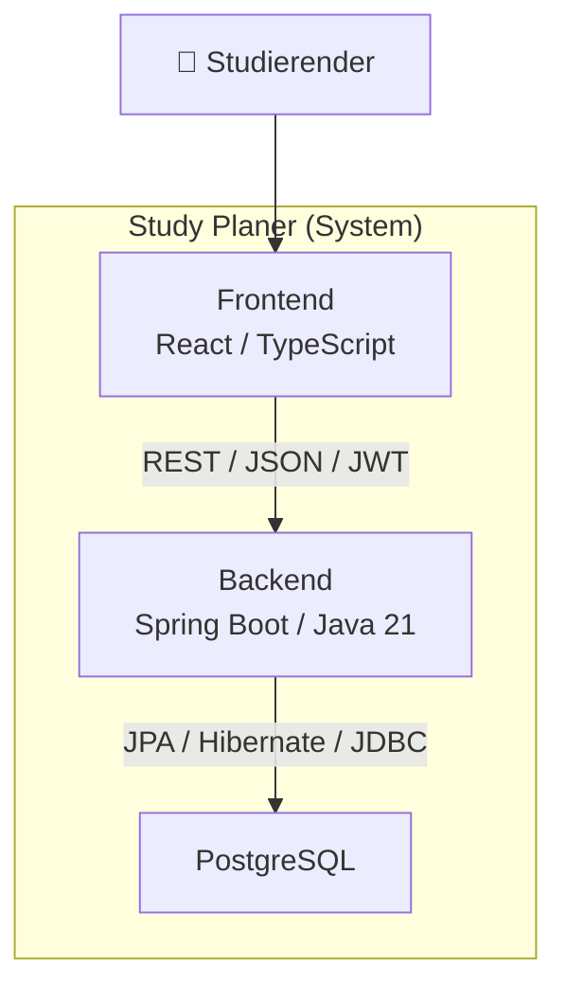
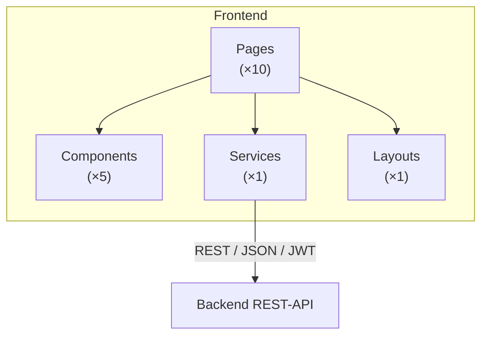
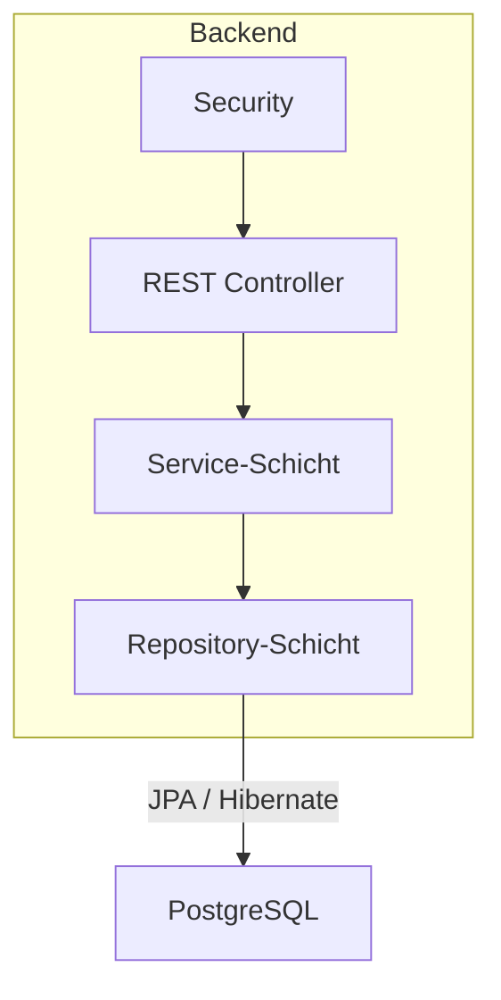
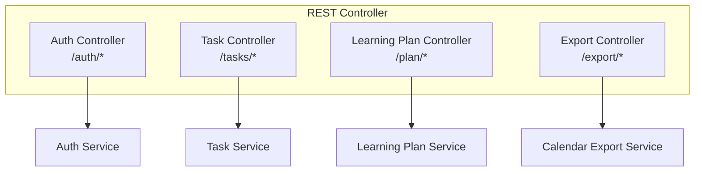
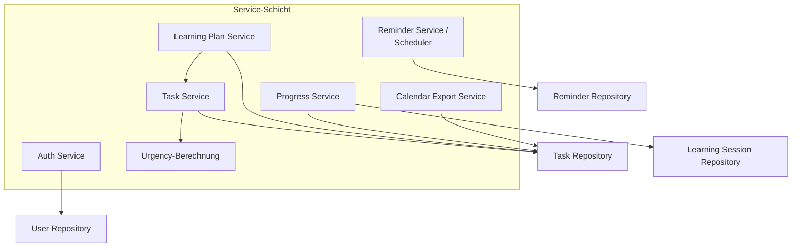

# 5 — Bausteinsicht

Dieses Kapitel beschreibt die statische Struktur des Study Planers nach dem Prinzip der schrittweisen Verfeinerung (top-down). Jede Ebene öffnet eine Whitebox der darüber liegenden Ebene und zeigt die enthaltenen Bausteine als Blackboxen.

Die Struktur orientiert sich an den Use Cases aus [F2](F2-anwendungsfaelle.md), den Anwendungsfunktionen aus [F3](F3-anwendungsfunktionen.md) sowie dem Datenmodell aus [D1](D1-datenmodell.md).

---

## 5.1 Whitebox "Study Planer System" 

Die in Kapitel 3 beschriebene Blackbox des Study Planer Systems wird auf dieser Ebene als Whitebox geöffnet. Sie besteht aus den drei wesentlichen Bausteinen: Frontend, Backend und Persistenz.



| Attribut | Inhalt |
|----------|--------|
| **Whitebox of** | Systemkontext ([Kapitel 3](03-kontextabgrenzung.md)) |
| **Overview diagram** | Siehe obenstehende Abbildung |
| **Contained building blocks** | [Frontend](#511-blackbox-frontend) (Blackbox), [Backend](#512-blackbox-backend) (Blackbox), [PostgreSQL](#513-blackbox-postgresql) (Blackbox) |
| **Local relationships** | Frontend → Backend (REST/JSON), Backend → PostgreSQL (JPA/Hibernate) |
| **Design decisions** | Trennung von Präsentation, Fachlichkeit und Persistenz; Backend als zentrale Berechnungsinstanz ([P2](P2-architekturueberblick.md)) |
| **Rejected alternatives** | Keine (Monolithische Desktop-Anwendung verworfen wegen [NFR-15-01](N1-nichtfunktionale-anforderungen.md)) |
| **References** | [F2](F2-anwendungsfaelle.md), [F3](F3-anwendungsfunktionen.md), [D1](D1-datenmodell.md), [S1](S1-nachbarsysteme.md) |
| **Open issues** | Keine |

---

### 5.1.1 Blackbox "Frontend"

| Attribut | Inhalt |
|----------|--------|
| **Purpose/Responsibility** | Darstellung der Benutzeroberfläche, Navigation zwischen Anwendungsbereichen, Erfassung und Bearbeitung von Aufgaben, Dashboard, Lernplan, Lernfortschritt, Validierungsmeldungen, Kalenderexport-Auslösung, Kommunikation mit der REST-API ([S1](S1-nachbarsysteme.md)) |
| **Interface(s) provided** | Browser-basierte Bedienoberfläche für den Studierenden ([B1](B1-dialogspezifikation.md)) |
| **Interface(s) required** | REST-API des Backends (JSON, JWT-Authentifizierung) |
| **Quality/performance** | Single Page Application, responsive Design ([NFR-15-01](N1-nichtfunktionale-anforderungen.md)) |
| **Dependencies** | React, TypeScript 5, moderner Browser ([P1](P1-ziele-rahmenbedingungen.md), CON-01) |
| **Code artefacts** | React-Komponenten, TypeScript-Dateien, CSS/SCSS |
| **Fulfilled requirements** | [UC-03](F2-anwendungsfaelle.md#uc-03--abmelden), [UC-04](F2-anwendungsfaelle.md#uc-04--aufgabe-anlegen), [UC-05](F2-anwendungsfaelle.md#uc-05--aufgabe-bearbeiten), [UC-06](F2-anwendungsfaelle.md#uc-06--aufgabe-löschen), [UC-07](F2-anwendungsfaelle.md#uc-07--dashboard-anzeigen), [UC-08](F2-anwendungsfaelle.md#uc-08--lernplan-anzeigen), [UC-09](F2-anwendungsfaelle.md#uc-09--lernfortschritt-eintragen), [UC-10](F2-anwendungsfaelle.md#uc-10--erinnerung-konfigurieren), [UC-11](F2-anwendungsfaelle.md#uc-11--kalenderexport), [NFR-15-01](N1-nichtfunktionale-anforderungen.md), [NFR-15-02](N1-nichtfunktionale-anforderungen.md) |
| **Risks** | Keine zentrale fachliche Berechnung im Frontend (gewollt, siehe [AZ-01](01-einfuehrung-und-ziele.md)) |
| **Open issues** | Keine |
| **Refined in** | [5.2.1](#521-whitebox-frontend) |

---

### 5.1.2 Blackbox "Backend"

| Attribut | Inhalt |
|----------|--------|
| **Purpose/Responsibility** | Zentrale fachliche Verarbeitung, Authentifizierung, Autorisierung, Geschäftslogik, Berechnung von Lernplan und Dringlichkeit, Datenpersistenz-Kapselung |
| **Interface(s) provided** | REST-API (JSON, JWT-geschützt, [S1](S1-nachbarsysteme.md)) |
| **Interface(s) required** | PostgreSQL-Datenbank |
| **Quality/performance** | Stateless, skalierbar, zentrale Berechnungsinstanz ([AZ-03](01-einfuehrung-und-ziele.md)) |
| **Dependencies** | Spring Boot, Spring Security, Spring Data JPA, Hibernate, Flyway ([P1](P1-ziele-rahmenbedingungen.md), CON-01) |
| **Code artefacts** | Java-Packages: `security`, `controller`, `service`, `repository`, `dto`, `entity` |
| **Fulfilled requirements** | [UC-01](F2-anwendungsfaelle.md#uc-01--registrieren), [UC-02](F2-anwendungsfaelle.md#uc-02--anmelden), [UC-03](F2-anwendungsfaelle.md#uc-03--abmelden), [UC-04](F2-anwendungsfaelle.md#uc-04--aufgabe-anlegen), [UC-05](F2-anwendungsfaelle.md#uc-05--aufgabe-bearbeiten), [UC-06](F2-anwendungsfaelle.md#uc-06--aufgabe-löschen), [UC-07](F2-anwendungsfaelle.md#uc-07--dashboard-anzeigen), [UC-08](F2-anwendungsfaelle.md#uc-08--lernplan-anzeigen), [UC-09](F2-anwendungsfaelle.md#uc-09--lernfortschritt-eintragen), [UC-10](F2-anwendungsfaelle.md#uc-10--erinnerung-konfigurieren), [UC-11](F2-anwendungsfaelle.md#uc-11--kalenderexport), [NFR-12-01](N1-nichtfunktionale-anforderungen.md) bis [NFR-12-05](N1-nichtfunktionale-anforderungen.md) |
| **Risks** | Scheduler-Fehler dürfen normalen Betrieb nicht beeinträchtigen ([NFR-13-03](N1-nichtfunktionale-anforderungen.md)) |
| **Open issues** | Keine |
| **Refined in** | [5.2.2](#522-whitebox-backend) |

---

### 5.1.3 Blackbox "PostgreSQL"

| Attribut | Inhalt |
|----------|--------|
| **Purpose/Responsibility** | Persistente Speicherung aller Anwendungsdaten (Benutzer, Aufgaben, Unteraufgaben, Lernsessions, Erinnerungen) ([D1](D1-datenmodell.md)) |
| **Interface(s) provided** | SQL-Schnittstelle über JDBC |
| **Interface(s) required** | Keine (externes System) |
| **Quality/performance** | ACID-konform, relationale Datenbank |
| **Dependencies** | PostgreSQL-Server (Docker-Container, [S3](S3-inbetriebnahme.md)) |
| **Code artefacts** | Flyway-Migrations-Skripte unter `backend/src/main/resources/db/migration/V*.sql` ([N2.4](N2-querschnittskonzepte.md)) |
| **Fulfilled requirements** | [NFR-16-01](N1-nichtfunktionale-anforderungen.md), [NFR-16-02](N1-nichtfunktionale-anforderungen.md) |
| **Risks** | Keine |
| **Open issues** | Keine |
| **Refined in** | Keine (externes System, keine weitere Verfeinerung) |

---

## 5.2 Verfeinerungsebene 2

### 5.2.1 Whitebox "Frontend"

| Attribut | Inhalt |
|----------|--------|
| **Whitebox of** | [5.1.1 Blackbox "Frontend"](#511-blackbox-frontend) |
| **Overview diagram** | Siehe Abbildung 5.2 |
| **Contained building blocks** | [Pages](#5211-blackbox-pages) (×10), [Components](#5212-blackbox-components) (×5), [Services](#5213-blackbox-services) (×1), [Layouts](#5214-blackbox-layouts) (×1) |
| **Local relationships** | Pages nutzen Components und Layouts; Services kommunizieren mit Backend-REST-API |
| **Design decisions** | Komponentenbasierte Architektur nach React-Idiom; eine Page pro Hauptansicht ([B1](B1-dialogspezifikation.md)); wiederverwendbare Components für Formulare, Listen, Dashboard-Widgets |
| **Rejected alternatives** | Keine zentrale State-Management-Library (Pinia/Vuex) — State wird serverseitig gehalten ([N2.1](N2-querschnittskonzepte.md)) |
| **References** | [5.1.1](#511-blackbox-frontend), [B1](B1-dialogspezifikation.md) |
| **Open issues** | Keine |



#### 5.2.1.1 Blackbox "Pages"

| Attribut | Inhalt |
|----------|--------|
| **Purpose/Responsibility** | Darstellung der einzelnen Ansichten der Anwendung: Login, Registrierung, Dashboard, Aufgabenliste, Aufgabe anlegen, Aufgabendetail, Aufgabe bearbeiten, Lernplan, Einstellungen ([B1](B1-dialogspezifikation.md)) |
| **Interface(s) provided** | React-Routes für die Navigation ([B1.1](B1-dialogspezifikation.md#b11-navigationsstruktur)) |
| **Interface(s) required** | Components, Layouts, Services |
| **Quality/performance** | Lazy Loading für Performance |
| **Dependencies** | React Router |
| **Code artefacts** | `pages/*.tsx` |
| **Fulfilled requirements** | [UC-01](F2-anwendungsfaelle.md#uc-01--registrieren) bis [UC-11](F2-anwendungsfaelle.md#uc-11--kalenderexport) |
| **Risks** | Keine |
| **Open issues** | Keine |
| **Refined in** | Keine (Aggregation, keine weitere Verfeinerung notwendig) |

#### 5.2.1.2 Blackbox "Components"

| Attribut | Inhalt |
|----------|--------|
| **Purpose/Responsibility** | Wiederverwendbare UI-Elemente: Formulare, Listen, Dashboard-Widgets, Validierungsanzeigen, Fortschrittsbalken, Ampelfarben-Darstellung ([B1](B1-dialogspezifikation.md)) |
| **Interface(s) provided** | Props-basierte React-Komponenten |
| **Interface(s) required** | Keine (atomare Bausteine) |
| **Quality/performance** | Wiederverwendbar, getestet |
| **Dependencies** | React, CSS/SCSS |
| **Code artefacts** | `components/*.tsx` |
| **Fulfilled requirements** | [UC-04](F2-anwendungsfaelle.md#uc-04--aufgabe-anlegen), [UC-05](F2-anwendungsfaelle.md#uc-05--aufgabe-bearbeiten), [UC-07](F2-anwendungsfaelle.md#uc-07--dashboard-anzeigen), [UC-09](F2-anwendungsfaelle.md#uc-09--lernfortschritt-eintragen), [NFR-15-02](N1-nichtfunktionale-anforderungen.md) |
| **Risks** | Keine |
| **Open issues** | Keine |
| **Refined in** | Keine (Aggregation) |

#### 5.2.1.3 Blackbox "Services"

| Attribut | Inhalt |
|----------|--------|
| **Purpose/Responsibility** | Kapselung der HTTP-Kommunikation mit dem Backend, JWT-Handling, Fehlerbehandlung ([N2.2](N2-querschnittskonzepte.md)) |
| **Interface(s) provided** | TypeScript-Funktionen für API-Aufrufe |
| **Interface(s) required** | Backend REST-API ([S1](S1-nachbarsysteme.md)) |
| **Quality/performance** | Axios/Fetch mit Interceptors für JWT; 401-Antworten leiten auf `/login` um ([N2.2](N2-querschnittskonzepte.md)) |
| **Dependencies** | Axios oder Fetch API |
| **Code artefacts** | `services/api.ts` |
| **Fulfilled requirements** | Alle UC mit Backend-Kommunikation |
| **Risks** | Keine |
| **Open issues** | Keine |
| **Refined in** | Keine |

#### 5.2.1.4 Blackbox "Layouts"

| Attribut | Inhalt |
|----------|--------|
| **Purpose/Responsibility** | Gemeinsame Layout-Struktur: Navigation, Header, Footer, Sidebar ([B1](B1-dialogspezifikation.md)) |
| **Interface(s) provided** | Layout-Komponente mit Slots für Page-Inhalte |
| **Interface(s) required** | Keine |
| **Quality/performance** | Konsistentes UI-Layout über alle Pages; responsive ([NFR-15-01](N1-nichtfunktionale-anforderungen.md)) |
| **Dependencies** | React |
| **Code artefacts** | `layouts/*.tsx` |
| **Fulfilled requirements** | [NFR-15-01](N1-nichtfunktionale-anforderungen.md) |
| **Risks** | Keine |
| **Open issues** | Keine |
| **Refined in** | Keine |

---

### 5.2.2 Whitebox "Backend"

| Attribut | Inhalt |
|----------|--------|
| **Whitebox of** | [5.1.2 Blackbox "Backend"](#512-blackbox-backend) |
| **Overview diagram** | Siehe Abbildung 5.3 |
| **Contained building blocks** | [Security](#5221-blackbox-security), [REST Controller](#5222-blackbox-rest-controller), [Service-Schicht](#5223-blackbox-service-schicht), [Repository-Schicht](#5224-blackbox-repository-schicht) |
| **Local relationships** | Security → REST Controller (Absicherung); REST Controller → Service-Schicht; Service-Schicht → Repository-Schicht |
| **Design decisions** | Schichtenarchitektur nach Spring-Boot-Idiom; klare Trennung von Präsentation, Fachlichkeit und Datenzugriff ([AZ-01](01-einfuehrung-und-ziele.md)) |
| **Rejected alternatives** | Keine direkte Datenbankanbindung aus Controllern |
| **References** | [5.1.2](#512-blackbox-backend), [F3](F3-anwendungsfunktionen.md) |
| **Open issues** | Keine |



#### 5.2.2.1 Blackbox "Security"

| Attribut | Inhalt |
|----------|--------|
| **Purpose/Responsibility** | Authentifizierung und technische Absicherung der API; Verarbeitung von Login/Registrierung; JWT-Erzeugung und -Validierung; Prüfung des `Authorization`-Headers; Bereitstellung der authentifizierten Benutzeridentität für die weitere Verarbeitung ([N2.1](N2-querschnittskonzepte.md)) |
| **Interface(s) provided** | Geschützte API-Endpunkte, JWT-Validierung |
| **Interface(s) required** | Auth Service (für Benutzerprüfung) |
| **Quality/performance** | Stateless JWT-Authentifizierung; HS256-signiert, Ablaufzeit 24 h ([N2.1](N2-querschnittskonzepte.md)) |
| **Dependencies** | Spring Security, `JwtAuthenticationFilter` ([N2.1](N2-querschnittskonzepte.md)) |
| **Code artefacts** | `security/JwtAuthenticationFilter.java`, `security/SecurityConfig.java` |
| **Fulfilled requirements** | [UC-01](F2-anwendungsfaelle.md#uc-01--registrieren), [UC-02](F2-anwendungsfaelle.md#uc-02--anmelden), [UC-03](F2-anwendungsfaelle.md#uc-03--abmelden), [NFR-12-01](N1-nichtfunktionale-anforderungen.md) bis [NFR-12-05](N1-nichtfunktionale-anforderungen.md), [N2.1](N2-querschnittskonzepte.md) |
| **Risks** | JWT-Secret muss sicher verwaltet werden ([P1](P1-ziele-rahmenbedingungen.md), R-02) |
| **Open issues** | Keine |
| **Refined in** | Keine |

#### 5.2.2.2 Blackbox "REST Controller"

| Attribut | Inhalt |
|----------|--------|
| **Purpose/Responsibility** | Entgegennahme von HTTP-Anfragen, Eingabevalidierung, Delegation an die jeweilige Service-Komponente; Keine umfangreiche fachliche Geschäftslogik ([S1](S1-nachbarsysteme.md)) |
| **Interface(s) provided** | REST-Endpunkte: `/auth/*`, `/tasks/*`, `/plan/*`, `/export/*` ([S1.1](S1-nachbarsysteme.md#s11-rest-api-frontend--backend)) |
| **Interface(s) required** | Jeweilige Services |
| **Quality/performance** | JSON-API, HTTP-Statuscodes nach RFC; globaler `@ControllerAdvice` für Fehlerbehandlung ([N2.2](N2-querschnittskonzepte.md)) |
| **Dependencies** | Spring Web, Spring Validation |
| **Code artefacts** | `controller/AuthController.java`, `controller/TaskController.java`, `controller/LearningPlanController.java`, `controller/ExportController.java` |
| **Fulfilled requirements** | [UC-01](F2-anwendungsfaelle.md#uc-01--registrieren) bis [UC-11](F2-anwendungsfaelle.md#uc-11--kalenderexport) |
| **Risks** | Keine |
| **Open issues** | Keine |
| **Refined in** | [5.3.1](#531-whitebox-rest-controller) |

#### 5.2.2.3 Blackbox "Service-Schicht"

| Attribut | Inhalt |
|----------|--------|
| **Purpose/Responsibility** | Zentrale Geschäftslogik des Study Planers; Abbildung der fachlichen Bereiche aus [F3](F3-anwendungsfunktionen.md); Berechnung von Lernplan, Dringlichkeit, Fortschritt; Reminder-Scheduling; Kalenderexport |
| **Interface(s) provided** | Fachliche Methoden für Controller |
| **Interface(s) required** | Repository-Schicht |
| **Quality/performance** | Transaktionssicher, fachlich konsistent; `@Transactional` auf Service-Methoden ([N2.4](N2-querschnittskonzepte.md)) |
| **Dependencies** | Spring Transaction, Spring Scheduling |
| **Code artefacts** | `service/*.java` |
| **Fulfilled requirements** | [UC-01](F2-anwendungsfaelle.md#uc-01--registrieren) bis [UC-11](F2-anwendungsfaelle.md#uc-11--kalenderexport), [AF-01](F3-anwendungsfunktionen.md#af-01--lernplan-berechnen) bis [AF-12](F3-anwendungsfunktionen.md#af-12--ical-datei-generieren) |
| **Risks** | Scheduler-Fehler dürfen normalen Betrieb nicht beeinträchtigen ([NFR-13-03](N1-nichtfunktionale-anforderungen.md)) |
| **Open issues** | Keine |
| **Refined in** | [5.3.2](#532-whitebox-service-schicht) |

#### 5.2.2.4 Blackbox "Repository-Schicht"

| Attribut | Inhalt |
|----------|--------|
| **Purpose/Responsibility** | Kapselung des Datenzugriffs auf PostgreSQL; Verwendung von Spring Data JPA und Hibernate; Keine fachliche Geschäftslogik ([N2.4](N2-querschnittskonzepte.md)) |
| **Interface(s) provided** | CRUD-Operationen für Entitäten |
| **Interface(s) required** | PostgreSQL |
| **Quality/performance** | JPA/Hibernate, Flyway für Schema-Migrationen ([N2.4](N2-querschnittskonzepte.md), [NFR-16-02](N1-nichtfunktionale-anforderungen.md)) |
| **Dependencies** | Spring Data JPA, Hibernate, Flyway |
| **Code artefacts** | `repository/*.java` |
| **Fulfilled requirements** | Alle UC mit Datenpersistenz |
| **Risks** | N+1-Select-Probleme bei komplexen Abfragen |
| **Open issues** | Keine |
| **Refined in** | Keine |

---

## 5.3 Verfeinerungsebene 3

### 5.3.1 Whitebox "REST Controller"

| Attribut | Inhalt |
|----------|--------|
| **Whitebox of** | [5.2.2.2 Blackbox "REST Controller"](#5222-blackbox-rest-controller) |
| **Overview diagram** | Siehe Abbildung 5.4 |
| **Contained building blocks** | [Auth Controller](#5311-blackbox-auth-controller), [Task Controller](#5312-blackbox-task-controller), [Learning Plan Controller](#5313-blackbox-learning-plan-controller), [Export Controller](#5314-blackbox-export-controller) |
| **Local relationships** | Jeder Controller delegiert an die entsprechende Service-Komponente |
| **Design decisions** | Ein Controller pro fachlichem Bereich; klare URL-Struktur nach REST-Prinzipien ([S1.1](S1-nachbarsysteme.md#s11-rest-api-frontend--backend)) |
| **Rejected alternatives** | Ein zentraler Controller für alle Bereiche (verworfen wegen schlechter Wartbarkeit) |
| **References** | [5.2.2.2](#5222-blackbox-rest-controller), [S1](S1-nachbarsysteme.md) |
| **Open issues** | Keine |



#### 5.3.1.1 Blackbox "Auth Controller"

| Attribut | Inhalt |
|----------|--------|
| **Purpose/Responsibility** | HTTP-Endpunkte für Registrierung und Anmeldung |
| **Interface(s) provided** | `POST /api/v1/auth/register`, `POST /api/v1/auth/login` ([S1.1.1](S1-nachbarsysteme.md#s111-authentifizierung)) |
| **Interface(s) required** | [Auth Service](#5321-blackbox-auth-service) |
| **Quality/performance** | JSON-Validierung, HTTP-Statuscodes |
| **Dependencies** | Spring Web, Spring Validation |
| **Code artefacts** | `controller/AuthController.java` |
| **Fulfilled requirements** | [UC-01](F2-anwendungsfaelle.md#uc-01--registrieren), [UC-02](F2-anwendungsfaelle.md#uc-02--anmelden) |
| **Risks** | Keine |
| **Open issues** | Keine |
| **Refined in** | Keine |

#### 5.3.1.2 Blackbox "Task Controller"

| Attribut | Inhalt |
|----------|--------|
| **Purpose/Responsibility** | HTTP-Endpunkte für Aufgabenverwaltung und Lernfortschritt |
| **Interface(s) provided** | `GET/POST/PUT/DELETE /api/v1/tasks/*`, `PATCH /api/v1/tasks/{id}/progress` ([S1.1.2](S1-nachbarsysteme.md#s112-aufgaben)) |
| **Interface(s) required** | [Task Service](#5322-blackbox-task-service), [Progress Service](#5325-blackbox-progress-service) |
| **Quality/performance** | JSON-Validierung, Ownership-Prüfung über Service ([AF-07](F3-anwendungsfunktionen.md#af-07--ownership-prüfen)) |
| **Dependencies** | Spring Web |
| **Code artefacts** | `controller/TaskController.java` |
| **Fulfilled requirements** | [UC-04](F2-anwendungsfaelle.md#uc-04--aufgabe-anlegen), [UC-05](F2-anwendungsfaelle.md#uc-05--aufgabe-bearbeiten), [UC-06](F2-anwendungsfaelle.md#uc-06--aufgabe-löschen), [UC-07](F2-anwendungsfaelle.md#uc-07--dashboard-anzeigen), [UC-09](F2-anwendungsfaelle.md#uc-09--lernfortschritt-eintragen) |
| **Risks** | Keine |
| **Open issues** | Keine |
| **Refined in** | Keine |

#### 5.3.1.3 Blackbox "Learning Plan Controller"

| Attribut | Inhalt |
|----------|--------|
| **Purpose/Responsibility** | HTTP-Endpunkt für den priorisierten Lernplan |
| **Interface(s) provided** | `GET /api/v1/plan`, `POST /api/v1/plan/recalculate` ([S1.1.3](S1-nachbarsysteme.md#s113-lernplan)) |
| **Interface(s) required** | [Learning Plan Service](#5323-blackbox-learning-plan-service) |
| **Quality/performance** | Berechnung serverseitig, DTO-Übertragung |
| **Dependencies** | Spring Web |
| **Code artefacts** | `controller/LearningPlanController.java` |
| **Fulfilled requirements** | [UC-08](F2-anwendungsfaelle.md#uc-08--lernplan-anzeigen) |
| **Risks** | Keine |
| **Open issues** | Keine |
| **Refined in** | Keine |

#### 5.3.1.4 Blackbox "Export Controller"

| Attribut | Inhalt |
|----------|--------|
| **Purpose/Responsibility** | HTTP-Endpunkt für den Kalenderexport als `.ics`-Datei |
| **Interface(s) provided** | `GET /api/v1/export/ical` ([S1.1.4](S1-nachbarsysteme.md#s114-export)) |
| **Interface(s) required** | [Calendar Export Service](#5327-blackbox-calendar-export-service) |
| **Quality/performance** | RFC-5545-konforme `.ics`-Datei; leere valide Datei bei 0 offenen Aufgaben ([NFR-13-02](N1-nichtfunktionale-anforderungen.md)) |
| **Dependencies** | Spring Web |
| **Code artefacts** | `controller/ExportController.java` |
| **Fulfilled requirements** | [UC-11](F2-anwendungsfaelle.md#uc-11--kalenderexport) |
| **Risks** | Keine |
| **Open issues** | Keine |
| **Refined in** | Keine |

---

### 5.3.2 Whitebox "Service-Schicht"

| Attribut | Inhalt |
|----------|--------|
| **Whitebox of** | [5.2.2.3 Blackbox "Service-Schicht"](#5223-blackbox-service-schicht) |
| **Overview diagram** | Siehe Abbildung 5.5 |
| **Contained building blocks** | [Auth Service](#5321-blackbox-auth-service), [Task Service](#5322-blackbox-task-service), [Learning Plan Service](#5323-blackbox-learning-plan-service), [Urgency-Berechnung](#5324-blackbox-urgency-berechnung), [Progress Service](#5325-blackbox-progress-service), [Reminder Service / Scheduler](#5326-blackbox-reminder-service--scheduler), [Calendar Export Service](#5327-blackbox-calendar-export-service) |
| **Local relationships** | Services greifen auf Repository-Schicht zu; Learning Plan Service nutzt Task Service; Reminder Service wird durch Scheduler getriggert |
| **Design decisions** | Ein Service pro fachlichem Bereich; zentrale Berechnung von Lernplan und Dringlichkeit im Backend; Scheduler isoliert mit Fehlertoleranz ([NFR-13-03](N1-nichtfunktionale-anforderungen.md)) |
| **Rejected alternatives** | Keine |
| **References** | [5.2.2.3](#5223-blackbox-service-schicht), [F3](F3-anwendungsfunktionen.md) |
| **Open issues** | Keine |



#### 5.3.2.1 Blackbox "Auth Service"

| Attribut | Inhalt |
|----------|--------|
| **Purpose/Responsibility** | Registrierung neuer Benutzer, Prüfung der Anmeldedaten, Erzeugung von Authentifizierungsinformationen, Speicherung des Passworts ausschließlich als bcrypt-Hash ([P1](P1-ziele-rahmenbedingungen.md), CON-07) |
| **Interface(s) provided** | `register()`, `login()`, `validateToken()` |
| **Interface(s) required** | User Repository |
| **Quality/performance** | bcrypt-Hashing mit Kostenfaktor 12, JWT-Erzeugung ([NFR-12-01](N1-nichtfunktionale-anforderungen.md), [N2.1](N2-querschnittskonzepte.md)) |
| **Dependencies** | Spring Security, JWT-Bibliothek |
| **Code artefacts** | `service/AuthService.java` |
| **Fulfilled requirements** | [UC-01](F2-anwendungsfaelle.md#uc-01--registrieren), [UC-02](F2-anwendungsfaelle.md#uc-02--anmelden), [UC-03](F2-anwendungsfaelle.md#uc-03--abmelden) |
| **Risks** | Passwörter dürfen nie im Klartext gespeichert werden ([NFR-12-01](N1-nichtfunktionale-anforderungen.md)) |
| **Open issues** | Keine |
| **Refined in** | Keine |

#### 5.3.2.2 Blackbox "Task Service"

| Attribut | Inhalt |
|----------|--------|
| **Purpose/Responsibility** | Anlegen, Lesen, Bearbeiten, Löschen von Aufgaben; Validierung der Aufgabeninformationen; Ownership-Prüfung ([AF-07](F3-anwendungsfunktionen.md#af-07--ownership-prüfen)); Bereitstellung der TaskDTOs ([D2](D2-datentypenverzeichnis.md)) |
| **Interface(s) provided** | CRUD-Operationen für Aufgaben, TaskDTO-Bereitstellung |
| **Interface(s) required** | Task Repository |
| **Quality/performance** | Transaktionssicher, Ownership-Prüfung vor jeder Operation ([NFR-12-03](N1-nichtfunktionale-anforderungen.md)) |
| **Dependencies** | Spring Transaction |
| **Code artefacts** | `service/TaskService.java` |
| **Fulfilled requirements** | [UC-04](F2-anwendungsfaelle.md#uc-04--aufgabe-anlegen), [UC-05](F2-anwendungsfaelle.md#uc-05--aufgabe-bearbeiten), [UC-06](F2-anwendungsfaelle.md#uc-06--aufgabe-löschen), [UC-07](F2-anwendungsfaelle.md#uc-07--dashboard-anzeigen), [UC-09](F2-anwendungsfaelle.md#uc-09--lernfortschritt-eintragen), [AF-07](F3-anwendungsfunktionen.md#af-07--ownership-prüfen) |
| **Risks** | Keine |
| **Open issues** | Keine |
| **Refined in** | Keine |

#### 5.3.2.3 Blackbox "Learning Plan Service"

| Attribut | Inhalt |
|----------|--------|
| **Purpose/Responsibility** | Verarbeitung der offenen Aufgaben eines Benutzers und Erzeugung des priorisierten Lernplans; serverseitige Berechnung nach [AF-01](F3-anwendungsfunktionen.md#af-01--lernplan-berechnen); Berücksichtigung von verbleibenden Tagen, geschätztem Aufwand, Fortschritt, Prioritätsgewichtung |
| **Interface(s) provided** | `generateLearningPlan()` → `LearningPlanDTO` ([D2](D2-datentypenverzeichnis.md)) |
| **Interface(s) required** | Task Repository |
| **Quality/performance** | Tägliche Neuberechnung auf Anfrage; < 1 Sekunde für bis zu 50 Aufgaben ([NFR-11-03](N1-nichtfunktionale-anforderungen.md)) |
| **Dependencies** | Keine externen |
| **Code artefacts** | `service/LearningPlanService.java` |
| **Fulfilled requirements** | [UC-08](F2-anwendungsfaelle.md#uc-08--lernplan-anzeigen), [AF-01](F3-anwendungsfunktionen.md#af-01--lernplan-berechnen), [NFR-11-03](N1-nichtfunktionale-anforderungen.md) |
| **Risks** | Keine |
| **Open issues** | Keine |
| **Refined in** | Keine |

#### 5.3.2.4 Blackbox "Urgency-Berechnung"

| Attribut | Inhalt |
|----------|--------|
| **Purpose/Responsibility** | Berechnung der Dringlichkeit einer offenen Aufgabe nach [AF-02](F3-anwendungsfunktionen.md#af-02--dringlichkeit-berechnen-urgencylevel); Ergebnis: `UrgencyLevel` (`RED`, `YELLOW`, `GREEN`); Wert wird nicht persistiert, sondern bei der Erstellung des `TaskDTO` berechnet ([D2](D2-datentypenverzeichnis.md), [N2.6](N2-querschnittskonzepte.md)) |
| **Interface(s) provided** | `calculateUrgency(Task)` → `UrgencyLevel` |
| **Interface(s) required** | Keine (reine Berechnung) |
| **Quality/performance** | Synchron, performant |
| **Dependencies** | Keine |
| **Code artefacts** | `service/UrgencyCalculator.java` oder innerhalb Task Service |
| **Fulfilled requirements** | [UC-07](F2-anwendungsfaelle.md#uc-07--dashboard-anzeigen), [AF-02](F3-anwendungsfunktionen.md#af-02--dringlichkeit-berechnen-urgencylevel) |
| **Risks** | Keine |
| **Open issues** | Keine |
| **Refined in** | Keine |

#### 5.3.2.5 Blackbox "Progress Service"

| Attribut | Inhalt |
|----------|--------|
| **Purpose/Responsibility** | Aktualisierung von `progressPercent`, Ableitung von `TaskStatus` gemäß [AF-03](F3-anwendungsfunktionen.md#af-03--taskstatus-aus-fortschritt-ableiten), Verarbeitung optionaler Lernsessions, Aktualisierung der tatsächlichen Lernzeit (`actual_hours`) |
| **Interface(s) provided** | `updateProgress()`, `addLearningSession()` |
| **Interface(s) required** | Task Repository, Learning Session Repository |
| **Quality/performance** | Transaktionssicher |
| **Dependencies** | Spring Transaction |
| **Code artefacts** | `service/ProgressService.java` |
| **Fulfilled requirements** | [UC-09](F2-anwendungsfaelle.md#uc-09--lernfortschritt-eintragen), [AF-03](F3-anwendungsfunktionen.md#af-03--taskstatus-aus-fortschritt-ableiten) |
| **Risks** | Keine |
| **Open issues** | Keine |
| **Refined in** | Keine |

#### 5.3.2.6 Blackbox "Reminder Service / Scheduler"

| Attribut | Inhalt |
|----------|--------|
| **Purpose/Responsibility** | Verarbeitung aktiver Erinnerungsregeln; tägliche Prüfung um 08:00 Uhr auf fällige Reminder ([AF-10](F3-anwendungsfunktionen.md#af-10--reminder-regeln-auswerten-scheduler)); optionale E-Mail-Benachrichtigung ([AF-11](F3-anwendungsfunktionen.md#af-11--e-mail-benachrichtigung-versenden)); Fehlertoleranz — Scheduler-Fehler beeinträchtigen normalen Betrieb nicht ([NFR-13-03](N1-nichtfunktionale-anforderungen.md)) |
| **Interface(s) provided** | `checkReminders()`, `sendNotification()` |
| **Interface(s) required** | Reminder Repository, optional SMTP ([S1.2](S1-nachbarsysteme.md#s12-smtp--e-mail-provider-optional)) |
| **Quality/performance** | Täglicher Cron-Job (`0 0 8 * * *`), asynchrone E-Mail-Versendung |
| **Dependencies** | Spring Scheduling, optional Spring Mail |
| **Code artefacts** | `service/ReminderService.java`, `service/ReminderScheduler.java` |
| **Fulfilled requirements** | [UC-10](F2-anwendungsfaelle.md#uc-10--erinnerung-konfigurieren), [AF-10](F3-anwendungsfunktionen.md#af-10--reminder-regeln-auswerten-scheduler), [AF-11](F3-anwendungsfunktionen.md#af-11--e-mail-benachrichtigung-versenden) |
| **Risks** | SMTP-Ausfall darf System nicht blockieren ([NFR-13-03](N1-nichtfunktionale-anforderungen.md), [P1](P1-ziele-rahmenbedingungen.md) R-03) |
| **Open issues** | Keine |
| **Refined in** | Keine |

#### 5.3.2.7 Blackbox "Calendar Export Service"

| Attribut | Inhalt |
|----------|--------|
| **Purpose/Responsibility** | Erzeugung einer RFC-5545-konformen `.ics`-Datei aus offenen Aufgaben; für jede offene Aufgabe wird ein `VEVENT` erzeugt ([AF-12](F3-anwendungsfunktionen.md#af-12--ical-datei-generieren), [S1.3](S1-nachbarsysteme.md#s13-ical-schnittstelle)) |
| **Interface(s) provided** | `exportCalendar()` → `.ics`-Datei |
| **Interface(s) required** | Task Repository |
| **Quality/performance** | RFC-5545-konform |
| **Dependencies** | iCal4j oder eigene Implementierung |
| **Code artefacts** | `service/CalendarExportService.java` |
| **Fulfilled requirements** | [UC-11](F2-anwendungsfaelle.md#uc-11--kalenderexport), [AF-12](F3-anwendungsfunktionen.md#af-12--ical-datei-generieren) |
| **Risks** | Keine |
| **Open issues** | Keine |
| **Refined in** | Keine |

---

## 5.4 Persistenzmodell

Die Persistenz erfolgt in PostgreSQL. Die wichtigsten Beziehungen sind:

```text
USER
 │
 └── 1:n ── TASK
              │
              ├── 1:n ── SUBTASK
              │
              ├── 1:n ── LEARNING_SESSION
              │
              └── 1:n ── REMINDER
```

| Entität | Verantwortlicher Persistenzbereich | Querverweis |
|---------|------------------------------------|-------------|
| `USER` | Benutzerverwaltung | [D1.2](D1-datenmodell.md#d12-entitätsbeschreibungen) |
| `TASK` | Aufgabenverwaltung | [D1.2](D1-datenmodell.md#d12-entitätsbeschreibungen) |
| `SUBTASK` | Unteraufgaben | [D1.2](D1-datenmodell.md#d12-entitätsbeschreibungen) |
| `LEARNING_SESSION` | Lernfortschritt | [D1.2](D1-datenmodell.md#d12-entitätsbeschreibungen) |
| `REMINDER` | Erinnerungen | [D1.2](D1-datenmodell.md#d12-entitätsbeschreibungen) |

Die in [D1](D1-datenmodell.md) definierten Entitäten und Attribute sind für Datenbankschema und Code verbindlich. Die Datenbank wird über Spring Data JPA und Hibernate angesprochen. Schemaänderungen werden über Flyway verwaltet ([N2.4](N2-querschnittskonzepte.md)).

---

## 5.5 Zuordnung von Use Cases zu Bausteinen

| Use Case | Wesentliche Architekturbausteine |
|----------|-----------------------------------|
| [UC-01](F2-anwendungsfaelle.md#uc-01--registrieren) Registrieren | [Security](#5221-blackbox-security), [Auth Service](#5321-blackbox-auth-service), User Repository |
| [UC-02](F2-anwendungsfaelle.md#uc-02--anmelden) Anmelden | [Security](#5221-blackbox-security), [Auth Service](#5321-blackbox-auth-service) |
| [UC-03](F2-anwendungsfaelle.md#uc-03--abmelden) Abmelden | [Frontend](#511-blackbox-frontend), [Security](#5221-blackbox-security) |
| [UC-04](F2-anwendungsfaelle.md#uc-04--aufgabe-anlegen) Aufgabe anlegen | [Task Controller](#5312-blackbox-task-controller), [Task Service](#5322-blackbox-task-service), Task Repository |
| [UC-05](F2-anwendungsfaelle.md#uc-05--aufgabe-bearbeiten) Aufgabe bearbeiten | [Task Controller](#5312-blackbox-task-controller), [Task Service](#5322-blackbox-task-service), Task Repository, [Ownership](#5322-blackbox-task-service) |
| [UC-06](F2-anwendungsfaelle.md#uc-06--aufgabe-löschen) Aufgabe löschen | [Task Controller](#5312-blackbox-task-controller), [Task Service](#5322-blackbox-task-service), Task Repository, [Ownership](#5322-blackbox-task-service) |
| [UC-07](F2-anwendungsfaelle.md#uc-07--dashboard-anzeigen) Dashboard anzeigen | [Task Controller](#5312-blackbox-task-controller), [Task Service](#5322-blackbox-task-service), [Urgency-Berechnung](#5324-blackbox-urgency-berechnung) |
| [UC-08](F2-anwendungsfaelle.md#uc-08--lernplan-anzeigen) Lernplan anzeigen | [Learning Plan Controller](#5313-blackbox-learning-plan-controller), [Learning Plan Service](#5323-blackbox-learning-plan-service), Task Repository |
| [UC-09](F2-anwendungsfaelle.md#uc-09--lernfortschritt-eintragen) Lernfortschritt eintragen | [Task Controller](#5312-blackbox-task-controller), [Progress Service](#5325-blackbox-progress-service), Task Repository, Learning Session Repository |
| [UC-10](F2-anwendungsfaelle.md#uc-10--erinnerung-konfigurieren) Erinnerung konfigurieren | [Reminder Service / Scheduler](#5326-blackbox-reminder-service--scheduler), Reminder Repository, optional SMTP |
| [UC-11](F2-anwendungsfaelle.md#uc-11--kalenderexport) Kalenderexport | [Export Controller](#5314-blackbox-export-controller), [Calendar Export Service](#5327-blackbox-calendar-export-service), Task Repository |

---

## 5.6 Abgrenzung zur konkreten Implementierung

Die in diesem Kapitel beschriebenen Bausteine stellen die vorgesehene Architekturstruktur dar. Die konkreten Java-Klassen, TypeScript-Dateien und Paketnamen müssen mit der tatsächlichen Implementierung übereinstimmen. Vor der finalen M3-Abgabe wird diese Bausteinsicht daher gegen den Quellcode geprüft und gegebenenfalls angepasst. Damit wird die in der Aufgabenstellung geforderte Konsistenz zwischen Spezifikation, Architektur und Implementierung sichergestellt ([P1](P1-ziele-rahmenbedingungen.md), SC-01, SC-05).
