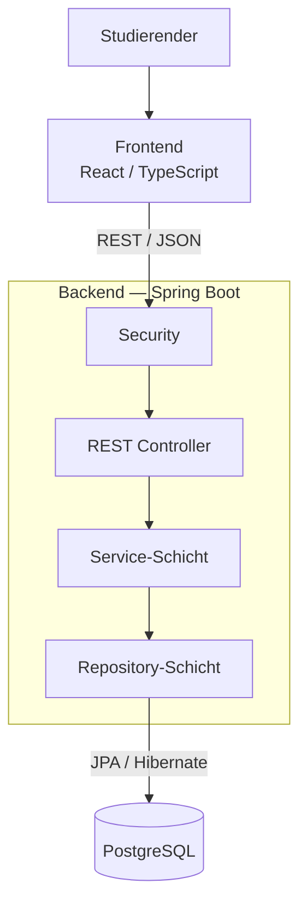

# 5 — Bausteinsicht

Dieses Kapitel beschreibt die statische Struktur des Study Planers. Die
Bausteine werden anhand ihrer Verantwortlichkeiten und ihrer Beziehungen
zueinander dargestellt.

Die Struktur orientiert sich an den Use Cases aus F2, den
Anwendungsfunktionen aus F3 sowie dem Datenmodell aus D1.

## 5.1 Gesamtstruktur

Der Study Planer wird in Frontend, Backend und Persistenz gegliedert.

Das Backend ist zusätzlich in eine API-Schicht, eine fachliche
Service-Schicht und eine Persistenzschicht unterteilt.



## 5.2 Frontend

Das Frontend wird als React-basierte Single Page Application mit TypeScript
realisiert.

### Verantwortlichkeiten

- Darstellung der Benutzeroberfläche
- Navigation zwischen den Anwendungsbereichen
- Erfassung und Bearbeitung von Aufgaben
- Darstellung des Dashboards
- Darstellung des Lernplans
- Eingabe und Anzeige des Lernfortschritts
- Darstellung von Validierungs- und Fehlermeldungen
- Auslösen des Kalenderexports
- Kommunikation mit der REST-API

Das Frontend enthält keine zentrale fachliche Berechnung des Lernplans oder
der Dringlichkeit. Diese Berechnungen werden durch das Backend durchgeführt.

### Schnittstelle zum Backend

Das Frontend verwendet die in S1 definierte REST-API.

Die Kommunikation erfolgt über JSON. Für geschützte Endpunkte wird der JWT
als Bearer Token übertragen.

Die in D2 definierten DTOs bilden die verbindliche Schnittstelle zwischen
Frontend und Backend.

## 5.3 Backend

Das Backend bildet den zentralen fachlichen Teil des Systems und wird mit
Spring Boot und Java realisiert.

Es besteht aus den Bereichen Security, REST Controller, Services und
Repositories.

### 5.3.1 Security

Die Security-Komponente ist für die Authentifizierung und die technische
Absicherung der API verantwortlich.

### Verantwortlichkeiten

- Verarbeitung von Login und Registrierung
- Erzeugung und Validierung von JWTs
- Prüfung des `Authorization`-Headers
- Bereitstellung der authentifizierten Benutzeridentität für die weitere
  Verarbeitung
- Schutz der nicht öffentlichen API-Endpunkte

Die technische Authentifizierung erfolgt über Spring Security und den in N2
beschriebenen `JwtAuthenticationFilter`.

Die Prüfung, ob eine Ressource tatsächlich dem authentifizierten Benutzer
gehört, erfolgt anschließend in der Service-Schicht.

### Zugeordnete Anforderungen

- UC-01 Registrierung
- UC-02 Anmeldung
- UC-03 Abmeldung
- NFR-12-01 bis NFR-12-05
- N2.1 Authentifizierung und Session

## 5.4 REST Controller

Die Controller-Schicht bildet die Schnittstelle zwischen Frontend und
Geschäftslogik.

Die Controller nehmen HTTP-Anfragen entgegen, führen die erforderliche
Eingabevalidierung durch und delegieren die Verarbeitung an die jeweilige
Service-Komponente.

Die Controller enthalten keine umfangreiche fachliche Geschäftslogik.

### Vorgesehene fachliche Controller-Bereiche

| Controller-Bereich | Zuständige API | Zugeordnete Use Cases |
|--------------------|----------------|-----------------------|
| Auth Controller | `/auth/*` | UC-01, UC-02 |
| Task Controller | `/tasks/*` | UC-04, UC-05, UC-06, UC-07, UC-09 |
| Learning Plan Controller | `/plan/*` | UC-08 |
| Export Controller | `/export/*` | UC-11 |

Die genaue Klassen- und Paketstruktur wird an die tatsächliche
Implementierung angepasst.

## 5.5 Service-Schicht

Die Service-Schicht enthält die zentrale Geschäftslogik des Study Planers.

Sie bildet die wesentlichen fachlichen Bereiche aus F3 ab.

### 5.5.1 Authentication Service

Verantwortlich für:

- Registrierung neuer Benutzer
- Prüfung der Anmeldedaten
- Erzeugung von Authentifizierungsinformationen
- Speicherung des Passworts ausschließlich als bcrypt-Hash

Zugeordnet:

- UC-01
- UC-02
- UC-03

### 5.5.2 Task Service

Der Task Service verwaltet die zentralen Aufgaben des Benutzers.

Verantwortlich für:

- Anlegen von Aufgaben
- Lesen von Aufgaben
- Bearbeiten von Aufgaben
- Löschen von Aufgaben
- Validierung der Aufgabeninformationen
- Ownership-Prüfung
- Bereitstellung der TaskDTOs

Zugeordnet:

- UC-04
- UC-05
- UC-06
- UC-07
- UC-09
- AF-07

### 5.5.3 Learning Plan Service

Der Learning Plan Service verarbeitet die offenen Aufgaben eines Benutzers
und erzeugt daraus den priorisierten Lernplan.

Die eigentliche Berechnung erfolgt entsprechend AF-01 serverseitig.

Berücksichtigt werden:

- verbleibende Tage bis zur Deadline
- geschätzter offener Aufwand
- Fortschritt
- Prioritätsgewichtung

Das Ergebnis wird als `LearningPlanDTO` bereitgestellt.

Zugeordnet:

- UC-08
- AF-01
- NFR-11-03

### 5.5.4 Urgency-Berechnung

Die Dringlichkeit einer offenen Aufgabe wird entsprechend AF-02
serverseitig berechnet.

Das Ergebnis ist ein `UrgencyLevel` mit den möglichen Werten:

- `RED`
- `YELLOW`
- `GREEN`

Der Wert wird nicht persistiert, sondern bei der Erstellung des
`TaskDTO` berechnet.

Zugeordnet:

- UC-07
- AF-02

### 5.5.5 Progress Service

Der Progress Service verarbeitet Aktualisierungen des Lernfortschritts.

Verantwortlich für:

- Aktualisierung von `progressPercent`
- Ableitung von `TaskStatus` gemäß AF-03
- Verarbeitung optionaler Lernsessions
- Aktualisierung der tatsächlichen Lernzeit

Zugeordnet:

- UC-09
- AF-03

### 5.5.6 Reminder Service / Scheduler

Die Reminder-Funktion verarbeitet aktive Erinnerungsregeln.

Der Scheduler wird täglich um 08:00 Uhr ausgeführt und prüft fällige
Reminder.

Bei entsprechender Konfiguration kann anschließend eine
E-Mail-Benachrichtigung ausgelöst werden.

Zugeordnet:

- UC-10
- AF-10
- AF-11

Fehler des Schedulers dürfen den normalen Betrieb des Systems nicht
beeinträchtigen.

### 5.5.7 Calendar Export Service

Der Calendar Export Service erzeugt aus den offenen Aufgaben eine
RFC-5545-konforme `.ics`-Datei.

Für jede offene Aufgabe wird ein `VEVENT` erzeugt.

Zugeordnet:

- UC-11
- AF-12

## 5.6 Repository-Schicht

Die Repository-Schicht kapselt den Zugriff auf die persistierten Daten.

Sie verwendet Spring Data JPA und Hibernate.

Die Repositories greifen auf die Entitäten aus D1 zu:

| Entität | Verantwortlicher Persistenzbereich |
|---------|------------------------------------|
| `USER` | Benutzerverwaltung |
| `TASK` | Aufgabenverwaltung |
| `SUBTASK` | Unteraufgaben |
| `LEARNING_SESSION` | Lernfortschritt |
| `REMINDER` | Erinnerungen |

Die Repository-Schicht enthält keine fachliche Geschäftslogik. Diese liegt
in der Service-Schicht.

## 5.7 Persistenzmodell

Die Persistenz erfolgt in PostgreSQL.

Die wichtigsten Beziehungen sind:

```text
USER
 │
 └── 1:n ── TASK
              │
              ├── 1:n ── SUBTASK
              │
              ├── 1:n ── LEARNING_SESSION
              │
              └── 1:n ── REMINDER
```

Die in D1 definierten Entitäten und Attribute sind für Datenbankschema und
Code verbindlich.

Die Datenbank wird über Spring Data JPA und Hibernate angesprochen.
Schemaänderungen werden über Flyway verwaltet.

## 5.8 Abhängigkeiten zwischen den Bausteinen

Die grundlegenden Abhängigkeiten verlaufen von außen nach innen:

```text
Frontend
   │
   ▼
REST Controller
   │
   ▼
Service-Schicht
   │
   ▼
Repository-Schicht
   │
   ▼
PostgreSQL
```

Die Security-Komponente wirkt als Querschnitt über die geschützten
API-Aufrufe.

Die Service-Schicht verwendet die fachlichen Funktionen aus F3 und greift
über die Repository-Schicht auf persistierte Daten zu.

## 5.9 Zuordnung von Use Cases zu Bausteinen

Die folgende Tabelle stellt die Verbindung zwischen Spezifikation und
Architektur her.

| Use Case | Wesentliche Architekturbausteine |
|----------|-----------------------------------|
| UC-01 Registrierung | Security, Auth Service, User Repository |
| UC-02 Anmeldung | Security, Auth Service |
| UC-03 Abmeldung | Frontend, Security |
| UC-04 Aufgabe anlegen | Task Controller, Task Service, Task Repository |
| UC-05 Aufgabe bearbeiten | Task Controller, Task Service, Task Repository, Ownership |
| UC-06 Aufgabe löschen | Task Controller, Task Service, Task Repository, Ownership |
| UC-07 Dashboard | Task Controller, Task Service, Urgency-Berechnung |
| UC-08 Lernplan | Learning Plan Controller, Learning Plan Service, Task Repository |
| UC-09 Lernfortschritt | Task Controller, Progress Service, Task Repository, Learning Session Repository |
| UC-10 Erinnerung | Reminder Service, Scheduler, Reminder Repository, optional SMTP |
| UC-11 Kalenderexport | Export Controller, Calendar Export Service, Task Repository |

Diese Zuordnung stellt sicher, dass die Use Cases aus F2 in der Architektur
wiederauffindbar sind.

## 5.10 Abgrenzung zur konkreten Implementierung

Die in diesem Kapitel beschriebenen Bausteine stellen die vorgesehene
Architekturstruktur dar.

Die konkreten Java-Klassen, TypeScript-Dateien und Paketnamen müssen mit der
tatsächlichen Implementierung übereinstimmen. Vor der finalen M3-Abgabe wird
diese Bausteinsicht daher gegen den Quellcode geprüft und gegebenenfalls
angepasst.

Damit wird die in der Aufgabenstellung geforderte Konsistenz zwischen
Spezifikation, Architektur und Implementierung sichergestellt.