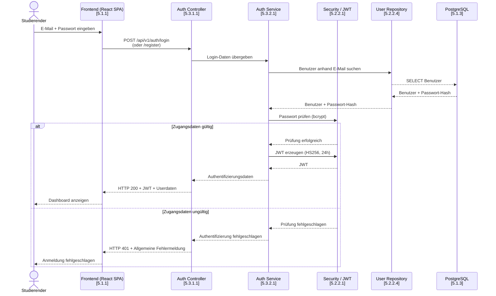
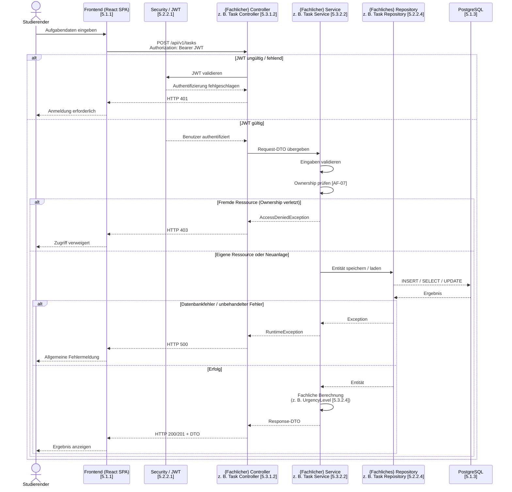
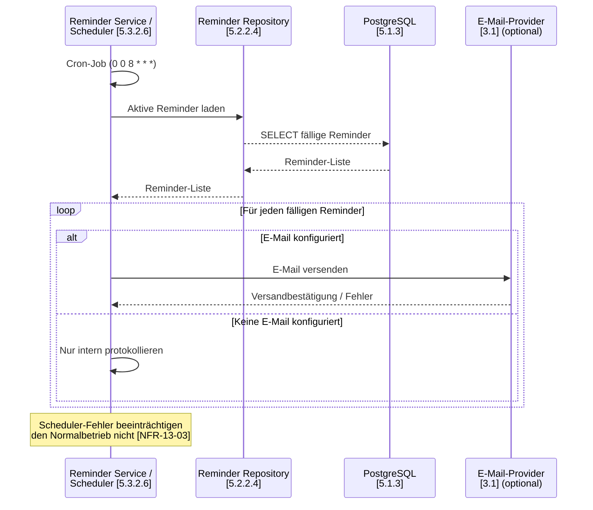

# 6 — Laufzeitsicht

Die Laufzeitsicht beschreibt das Verhalten der wesentlichen Architekturbausteine
zur Laufzeit. Da die Interaktionsmuster über die
meisten Use Cases hinweg identisch sind, werden hier zwei verallgemeinerte
Laufzeitszenarien dargestellt:

1. **Authentifizierung** (UC-01, UC-02) — detailliert, da hier der Umgang
   mit JWT und Security im Fokus steht.
2. **Fachlicher Request-Lebenszyklus** (UC-04 bis UC-09, UC-11) —
   verallgemeinert über alle authentifizierten fachlichen Operationen.
3. **Hintergrundprozess Reminder-Scheduler** (UC-10) — als ergänzender
   Ablauf ohne Frontend-Beteiligung.

Die verwendeten Bausteine entsprechen den in Kapitel 5 definierten
Blackboxen und Whiteboxen. Konkrete Controller/Service-Kombinationen
sind in [5.3](../arch/05-bausteinsicht.md) dokumentiert.

---

## 6.1 Authentifizierung — UC-01 / UC-02

Bei Registrierung und Anmeldung übermittelt das Frontend die
Anmeldedaten an den [Auth Controller](../arch/05-bausteinsicht.md#5311-blackbox-auth-controller).
Dieser delegiert an den [Auth Service](../arch/05-bausteinsicht.md#5321-blackbox-auth-service),
der die Prüfung über das [Security](../arch/05-bausteinsicht.md#5221-blackbox-security)-Modul
und die Datenbank durchführt.



Bei ungültigen Zugangsdaten wird keine Information darüber preisgegeben,
ob die E-Mail-Adresse oder das Passwort falsch war. Dies entspricht
[NFR-12-05](../spec/N1-nichtfunktionale-anforderungen.md).

Die **Abmeldung (UC-03)** erfolgt clientseitig durch Löschen des JWT im
Frontend ([5.2.1.3](../arch/05-bausteinsicht.md#5213-blackbox-services));
ein serverseitiger Invalidierungsmechanismus ist bei stateless JWT nicht
erforderlich.

---

## 6.2 Fachlicher Request-Lebenszyklus — UC-04 bis UC-09, UC-11

Nach erfolgreicher Authentifizierung folgen alle fachlichen Operationen
einem identischen Muster: Der Studierende löst über das Frontend einen
HTTP-Request aus. Das [Security](../arch/05-bausteinsicht.md#5221-blackbox-security)-Modul
prüft den JWT, bevor der zuständige fachliche Controller die Anfrage
annimmt und an die Service-Schicht delegiert.

Das folgende Diagramm zeigt das **verallgemeinerte Muster** am
Beispiel *Aufgabe anlegen (UC-04)*. Die konkreten Bausteine
(Task Controller / Task Service / Task Repository) sind durch die
jeweiligen fachlichen Entsprechungen aus [5.3](../arch/05-bausteinsicht.md)
ersetzbar (z. B. Learning Plan Controller / Learning Plan Service für
UC-08, Export Controller / Calendar Export Service für UC-11).



### Zuordnung der fachlichen Use Cases zu den konkreten Bausteinen

| Use Case | Controller [5.3.1] | Service [5.3.2] | Repository [5.2.2.4] |
|----------|-------------------|-----------------|----------------------|
| UC-04 Aufgabe anlegen | Task Controller | Task Service | Task Repository |
| UC-05 Aufgabe bearbeiten | Task Controller | Task Service | Task Repository |
| UC-06 Aufgabe löschen | Task Controller | Task Service | Task Repository |
| UC-07 Dashboard anzeigen | Task Controller | Task Service + Urgency-Berechnung [5.3.2.4] | Task Repository |
| UC-08 Lernplan anzeigen | Learning Plan Controller [5.3.1.3] | Learning Plan Service [5.3.2.3] | Task Repository |
| UC-09 Lernfortschritt eintragen | Task Controller | Progress Service [5.3.2.5] | Task Repository + Learning Session Repository |
| UC-11 Kalenderexport | Export Controller [5.3.1.4] | Calendar Export Service [5.3.2.7] | Task Repository |

Die fachliche Verarbeitung findet stets zentral in der Service-Schicht
statt. Die Controller dienen ausschließlich als API-Schnittstelle, die
Repository-Schicht kapselt den Datenbankzugriff.

---

## 6.3 Hintergrundprozess: Reminder-Scheduler — UC-10

Der [Reminder Service / Scheduler](../arch/05-bausteinsicht.md#5326-blackbox-reminder-service--scheduler)
ist ein Hintergrundprozess, der nicht durch ein Frontend-Event ausgelöst
wird. Er läuft täglich um 08:00 Uhr und prüft fällige Erinnerungen.



---

## 6.4 Zusammenfassung der Laufzeitarchitektur

Die wesentliche Kommunikation des Systems erfolgt entlang der folgenden,
in Kapitel 5 definierten Struktur:

```text
Studierender
     │
     ▼
Frontend (React SPA) [5.1.1]
     │
     ▼
Security / JWT [5.2.2.1]
     │
     ▼
{Fachlicher} REST Controller [5.3.1]
     │
     ▼
{Fachlicher} Service [5.3.2]
     │
     ▼
Repository-Schicht [5.2.2.4]
     │
     ▼
PostgreSQL [5.1.3]
```

Die dargestellten Szenarien decken die überwiegende Mehrheit der
Systemabläufe ab:
- **Authentifizierung** beschreibt den initialen Login/Registrierungs-Flow
  inklusive Token-Erzeugung.
- **Fachlicher Request-Lebenszyklus** beschreibt das einheitliche Muster
  aller authentifizierten Operationen von der Anfrage bis zur Persistenz.
- **Reminder-Scheduler** beschreibt den einzigen signifikant abweichenden
  Hintergrundprozess.

Fehler werden in allen Abläufen an der jeweiligen Architekturgrenze
gefangen und als standardisierte HTTP-Statuscodes (401, 403, 404, 500)
an das Frontend zurückgegeben, wo sie zentral über den in
[N2.2](../spec/N2-querschnittskonzepte.md) beschriebenen Interceptor
verarbeitet werden.
