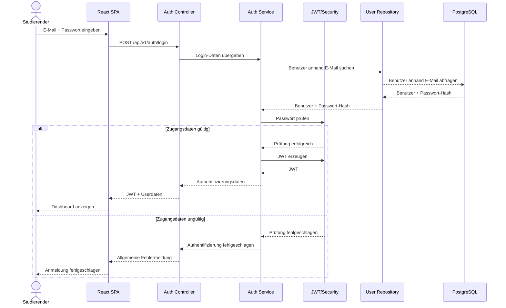
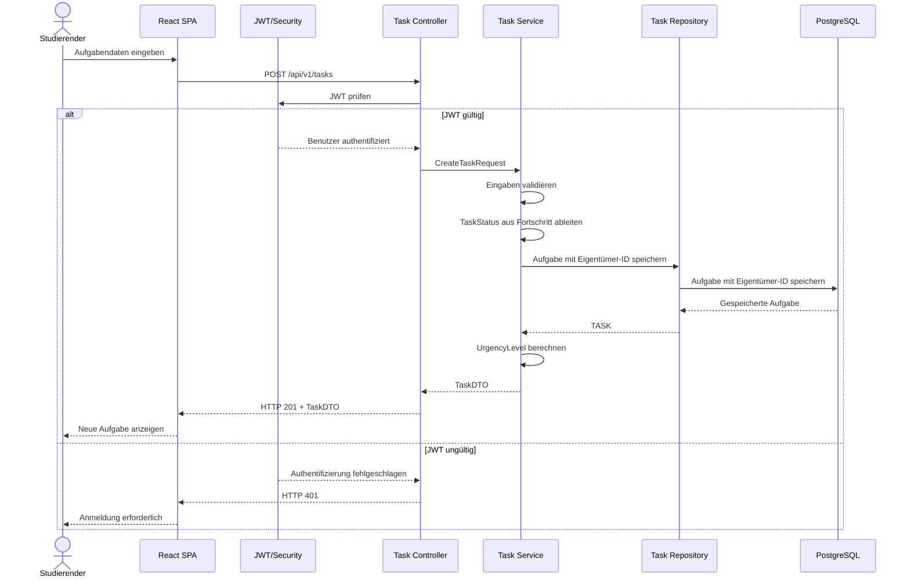
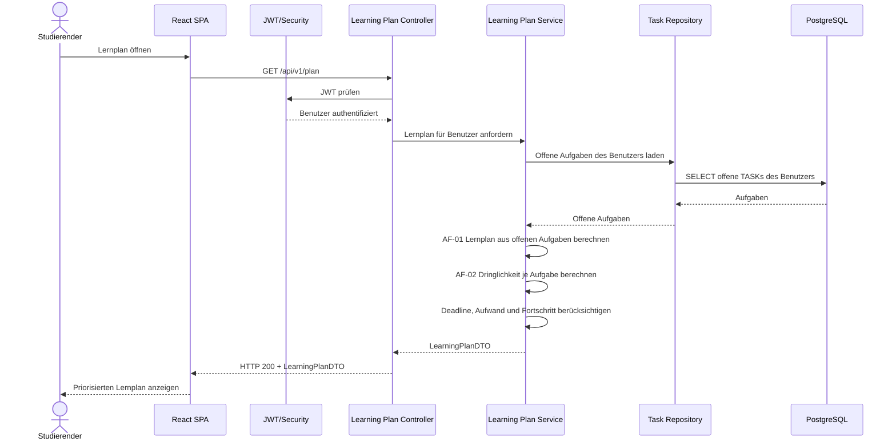
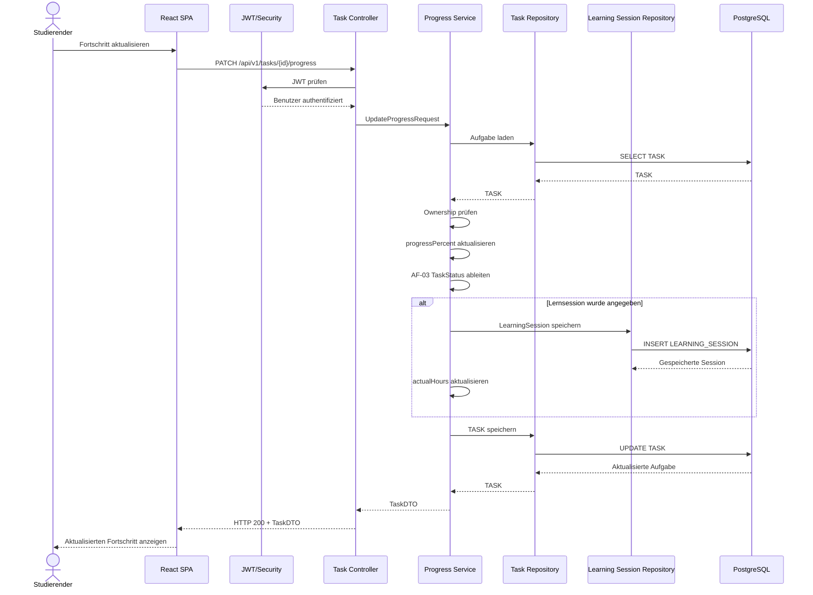
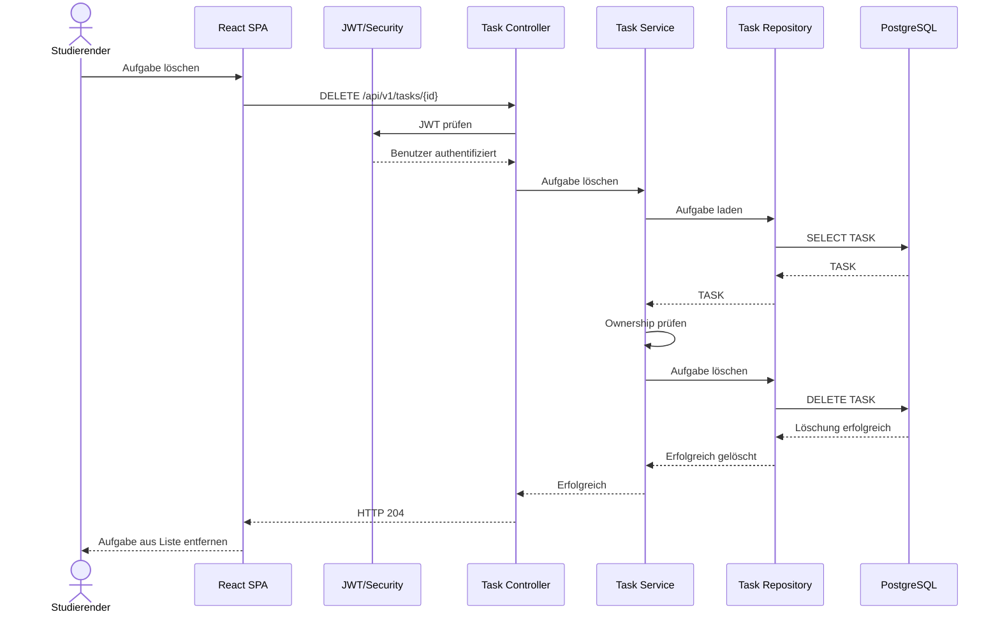

# 6 — Laufzeitsicht

Die Laufzeitsicht beschreibt das Verhalten der wesentlichen Architekturbausteine
zur Laufzeit. Dazu werden ausgewählte Abläufe aus den in der Spezifikation
beschriebenen Use Cases betrachtet.

Die dargestellten Abläufe zeigen insbesondere die Kommunikation zwischen
Frontend, REST-API, Security, Service-Schicht und Persistenz.

---

## 6.1 Anmeldung — UC-02

Bei der Anmeldung übermittelt der Studierende seine E-Mail-Adresse und sein
Passwort an das Backend.

Das Backend prüft die Zugangsdaten und stellt bei erfolgreicher
Authentifizierung ein JWT aus.



Bei ungültigen Zugangsdaten wird keine Information darüber preisgegeben, ob
die E-Mail-Adresse oder das Passwort falsch war. Dies entspricht NFR-12-05.

---

## 6.2 Aufgabe anlegen — UC-04

Beim Anlegen einer Aufgabe sendet das Frontend eine
`CreateTaskRequest` an den geschützten REST-Endpunkt.

Das Backend authentifiziert den Benutzer und übergibt die Anfrage an die
fachliche Aufgabenverwaltung.



Die Ownership-Prüfung ist beim Anlegen einer Aufgabe insbesondere dadurch
gewährleistet, dass die Eigentümer-ID aus der authentifizierten Identität
verwendet wird.

---

## 6.3 Lernplan berechnen — UC-08

Der Lernplan wird serverseitig aus den offenen Aufgaben des authentifizierten
Benutzers berechnet.

Die Berechnung berücksichtigt Deadline, offenen Aufwand, Fortschritt und
Prioritätsgewichtung.



Die eigentliche Berechnung erfolgt ausschließlich im Backend. Dadurch bleibt
die fachliche Logik zentral und kann unabhängig vom Frontend getestet werden.

---

## 6.4 Lernfortschritt aktualisieren — UC-09

Beim Aktualisieren des Lernfortschritts übermittelt das Frontend die neuen
Fortschrittsdaten und optional die Dauer der Lernsitzung an das Backend.

Das Backend authentifiziert den Benutzer, validiert die Eingaben und aktualisiert
den Lernfortschritt. Anschließend wird daraus der neue TaskStatus abgeleitet.



---

## 6.5 Aufgabe löschen — UC-06

Beim Löschen einer Aufgabe prüft das Backend zunächst die Authentifizierung
und anschließend die Ownership der Aufgabe.

Wird die Aufgabe gelöscht, werden die zugehörigen abhängigen Datensätze
gemäß den in D1 definierten Kaskadenregeln ebenfalls gelöscht.



---

## 6.6 Fehlerfall

Fehler werden entsprechend N2.2 zentral behandelt.

Bei einem ungültigen oder fehlenden JWT wird der Zugriff mit HTTP 401
abgelehnt.

Wird versucht, auf eine fremde Ressource zuzugreifen, wird die
Ownership-Prüfung ausgelöst und das Backend antwortet mit HTTP 403.

Bei nicht vorhandenen Ressourcen wird HTTP 404 zurückgegeben.

Unbehandelte interne Fehler werden durch den globalen
`@ControllerAdvice`-Handler abgefangen und als HTTP 500 zurückgegeben.


```text
Frontend
   |
   v
REST Controller
   |
   v
Service
   |
   +-- 401 -> nicht authentifiziert
   +-- 403 -> fremde Ressource
   +-- 404 -> Ressource nicht vorhanden
   +-- 500 -> interner Fehler
```

Das Frontend verarbeitet diese Fehler zentral über den in N2.2 beschriebenen
Axios-Interceptor und den zentralen Error-State.

---

## 6.7 Zusammenfassung

Die Laufzeitsicht zeigt, dass die wesentliche Kommunikation des Systems
entlang der folgenden Struktur erfolgt:

```text
Studierender
     │
     ▼
React SPA
     │
     ▼
REST Controller
     │
     ▼
Security / Authentifizierung
     │
     ▼
Service-Schicht
     │
     ▼
Repository-Schicht
     │
     ▼
PostgreSQL
```

Die fachliche Verarbeitung findet dabei zentral in der Service-Schicht statt.
Die Controller dienen als API-Schnittstelle und die Repository-Schicht
kapselt den Datenbankzugriff.

Die dargestellten Laufzeitszenarien stellen die Verbindung zwischen den
Use Cases aus der Spezifikation und den Architekturbausteinen her.
