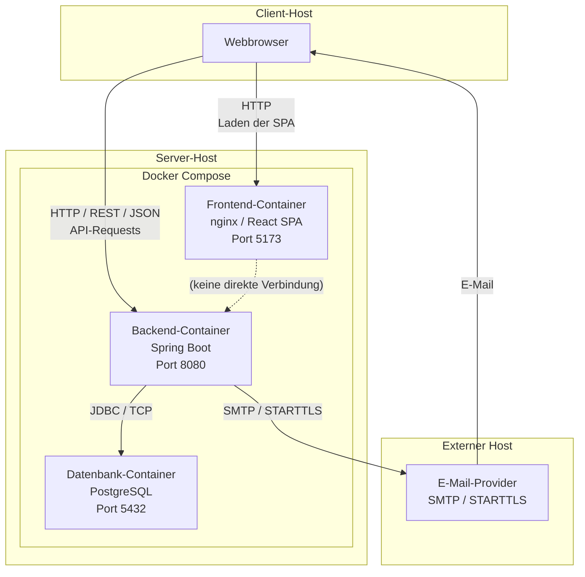

# 7 — Verteilungssicht

Die Verteilungssicht beschreibt, auf welchen technischen Knoten (Hosts) die Komponenten des Study Planers ausgeführt werden und wie diese über Netzwerkgrenzen hinweg kommunizieren.

---

## 7.1 Übersicht

Der Study Planer wird als containerisierte Webanwendung betrieben. Die Laufzeitkomponenten verteilen sich auf zwei Host-Grenzen:

- **Client-Host**: Der Rechner des Studierenden mit Webbrowser
- **Server-Host**: Ein physischer oder virtueller Server, auf dem Docker Compose die Anwendungscontainer verwaltet

Der grundlegende Aufbau der Verteilung ist:



**Wichtige Hinweise zur Darstellung:**

- Die React SPA wird vom Frontend-Container an den Webbrowser **ausgeliefert** (HTTP-Request auf Port 5173, Response mit statischen Assets).
- Nach der Auslieferung läuft die SPA **im Webbrowser** des Client-Hosts. Die REST-API-Requests werden daher vom Browser (Client-Host) direkt an den Backend-Container (Server-Host) gesendet — nicht vom Frontend-Container.
- Frontend-Container und Backend-Container kommunizieren untereinander **nicht direkt**.
- Die PostgreSQL-Datenbank ist ausschließlich vom Backend-Container erreichbar (internes Docker-Netzwerk).

---

## 7.2 Client-Host

Der Client-Host ist der Rechner des Studierenden. Auf ihm läuft ausschließlich der Webbrowser.

### 7.2.1 Webbrowser

Der Studierende greift über einen modernen Webbrowser auf die Anwendung zu.

Gemäß den Annahmen aus der Spezifikation werden aktuelle Versionen von Chrome, Firefox, Safari und Edge unterstützt.

Der Browser übernimmt zwei Rollen:

1. **Initialer Seitenaufruf**: Der Browser lädt die React SPA vom Frontend-Container (Port 5173). Die SPA besteht aus statischen Dateien (HTML, JavaScript, CSS), die einmalig übertragen werden.
2. **Laufzeitkommunikation**: Nach dem Laden läuft die SPA im Browser. Alle weiteren Interaktionen (Daten laden, speichern, berechnen) werden als HTTP-Requests direkt an den Backend-Container (Port 8080) gesendet.

---

## 7.3 Server-Host

Der Server-Host ist der Rechner, auf dem Docker Compose die Anwendung betreibt. Alle Container laufen auf diesem Host und kommunizieren über das interne Docker-Netzwerk.

### 7.3.1 Frontend-Container

Der Frontend-Container dient der Auslieferung der React SPA.

| Eigenschaft | Wert |
|-------------|------|
| Docker-Service | `frontend` |
| Technologie | nginx (Production) / Vite Dev Server (Entwicklung) |
| Exponierter Port | `5173` |
| Erreichbarkeit | Vom Client-Host über `http://<server-host>:5173` |
| Kommunikation | Empfängt HTTP-Requests vom Browser, liefert statische Assets aus |

Die SPA wird als gebündelte statische Dateien im Container bereitgestellt. Der Container hat keine direkte Verbindung zum Backend-Container oder zur Datenbank.

### 7.3.2 Backend-Container

Der Backend-Container führt die Spring-Boot-Anwendung aus.

| Eigenschaft | Wert |
|-------------|------|
| Docker-Service | `backend` |
| Technologie | Spring Boot / Java 21 |
| Exponierter Port | `8080` |
| API-Präfix | `/api/v1` |
| Erreichbarkeit | Vom Client-Host über `http://<server-host>:8080/api/v1/*` |
| Kommunikation | Empfängt REST-Requests vom Browser; greift auf PostgreSQL zu |

Der Backend-Container ist der einzige Baustein, der sowohl nach außen (REST-API) als auch nach innen (Datenbank) kommuniziert.

### 7.3.3 Datenbank-Container

Der Datenbank-Container führt PostgreSQL aus.

| Eigenschaft | Wert |
|-------------|------|
| Docker-Service | `db` |
| Technologie | PostgreSQL |
| Exponierter Port | `5432` (nur intern im Docker-Netzwerk) |
| Erreichbarkeit | **Nicht** vom Client-Host oder Browser erreichbar |
| Kommunikation | Nur vom Backend-Container über JDBC/TCP erreichbar |
| Persistenz | Docker Volume für Datenhaltung über Container-Neustarts |

Der Datenbank-Port ist nicht nach außen freigegeben. Der Zugriff erfolgt ausschließlich über das interne Docker-Netzwerk.

---

## 7.4 Externer Host: E-Mail-Provider

Der E-Mail-Provider ist ein optionales externes System auf einem eigenen Host.

| Eigenschaft | Wert |
|-------------|------|
| Host-Grenze | Extern (nicht im Docker Compose) |
| Schnittstelle | SMTP mit STARTTLS |
| Kommunikation | Backend-Container → E-Mail-Provider |
| Konfiguration | Umgebungsvariablen: `SMTP_HOST`, `SMTP_PORT`, `SMTP_USER`, `SMTP_PASS` |

Ist kein SMTP-Provider konfiguriert, wird der E-Mail-Kanal deaktiviert. Der übrige Betrieb wird nicht blockiert.

---

## 7.5 Netzwerkkommunikation über Host-Grenzen

Die folgende Tabelle fasst alle Kommunikationsbeziehungen mit ihren Host-Grenzen zusammen:

| Quelle (Host) | Ziel (Host) | Schnittstelle / Protokoll | Zweck |
|---------------|-------------|---------------------------|-------|
| Client-Host (Browser) | Server-Host (Frontend-Container) | HTTP | Laden der React SPA |
| Client-Host (Browser) | Server-Host (Backend-Container) | HTTP / REST / JSON | API-Kommunikation |
| Server-Host (Backend-Container) | Server-Host (DB-Container) | JDBC / TCP (internes Docker-Netzwerk) | Persistenzzugriff |
| Server-Host (Backend-Container) | Externer Host (E-Mail-Provider) | SMTP / STARTTLS | Optionale E-Mail-Erinnerungen |
| Externer Host (E-Mail-Provider) | Client-Host (Browser/Mail-Client) | E-Mail / SMTP | Zustellung der Benachrichtigung |

**Host-Grenzen:**

- **Grenze 1**: Client-Host ↔ Server-Host (HTTP/REST über Netzwerk)
- **Grenze 2**: Server-Host ↔ Externer Host (SMTP über Netzwerk)
- **Grenze 3** (intern): Frontend-Container ↔ Backend-Container ↔ DB-Container (Docker-Internes Netzwerk, für Frontend→Backend jedoch keine direkte Verbindung)

---

## 7.6 Containerisierung mit Docker Compose

Die Komponenten werden über Docker Compose auf dem Server-Host bereitgestellt.

Der Start erfolgt gemäß S3 mit:

```bash
docker compose up --build
```

Dadurch werden folgende Docker-Services gestartet:

| Service | Container | Funktion |
|---------|-----------|----------|
| `frontend` | React-SPA-Auslieferung | Statische Assets an Browser ausliefern |
| `backend` | Spring-Boot-Anwendung | REST-API bereitstellen |
| `db` | PostgreSQL-Datenbank | Persistente Datenspeicherung |

Für den vorgesehenen Betrieb ist keine lokale Installation von Java oder Node.js auf dem Server-Host erforderlich. Die Runtime-Abhängigkeiten sind in den Containern enthalten.

Die umgebungsabhängige Konfiguration wird über Umgebungsvariablen bereitgestellt. Sensible Werte wie Datenbankpasswörter, JWT-Secret und SMTP-Zugangsdaten werden nicht in das Repository eingecheckt.

---

## 7.7 Persistenz und Datenbankmigration

Das Datenbankschema wird beim Start der Anwendung automatisch über Flyway verwaltet.

Die Migrationen befinden sich gemäß N2 unter:

`backend/src/main/resources/db/migration/V*.sql`

Die PostgreSQL-Daten werden über ein Docker Volume persistent gespeichert. Dadurch bleiben die Daten auch bei einem Neustart oder einer Neuerstellung des Datenbank-Containers erhalten, sofern das konfigurierte Volume weiterverwendet wird.

Damit wird die in NFR-13-01 geforderte Erhaltung der Daten bei einem Neustart der Datenbank unterstützt.

---

## 7.8 Lokale Erreichbarkeit (Entwicklung)

Für die lokale Entwicklung, bei der Client-Host und Server-Host identisch sind (localhost), sind folgende Schnittstellen vorgesehen:

| Komponente | Adresse | Host-Grenze |
|------------|---------|-------------|
| Frontend (SPA-Auslieferung) | `http://localhost:5173` | Client = Server (localhost) |
| Backend (REST-API) | `http://localhost:8080/api/v1` | Client = Server (localhost) |
| PostgreSQL | `localhost:5432` (nur intern) | Server-Host intern |

In der Entwicklungsumgebung laufen Client und Server auf demselben Rechner. In einer Produktionsumgebung würde der Server-Host ein separater Rechner sein.

---

## 7.9 Abgrenzung

Die Verteilungssicht beschreibt die technische Verteilung der Systemkomponenten auf Laufzeit- und Infrastrukturkomponenten unter Berücksichtigung von Host-Grenzen.

- Die interne Struktur des Backends wird in Kapitel 5 (Bausteinsicht) beschrieben.
- Die Abläufe zwischen den Komponenten werden in Kapitel 6 (Laufzeitsicht) beschrieben.
- Die fachlichen Funktionen der Komponenten werden in Kapitel 3 (Kontextabgrenzung) und Kapitel 5 (Bausteinsicht) beschrieben.
- Die Begründung wesentlicher Technologie- und Architekturentscheidungen erfolgt in Kapitel 9 (Architekturentscheidungen).