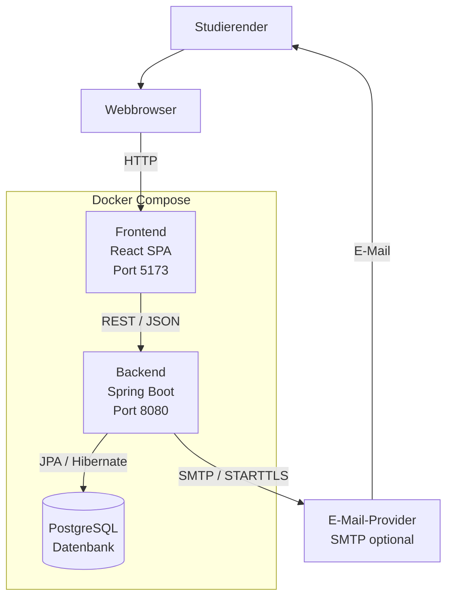

# 7 — Verteilungssicht

Die Verteilungssicht beschreibt, auf welchen technischen Knoten die Komponenten des Study Planers ausgeführt werden und wie diese miteinander kommunizieren.

Die Anwendung wird als containerisierte Webanwendung betrieben. Die einzelnen technischen Komponenten werden über Docker Compose gestartet.

---

## 7.1 Übersicht

Der Study Planer besteht aus folgenden zentralen Laufzeitkomponenten:

- Webbrowser des Studierenden
- Frontend als React Single Page Application
- Backend als Spring-Boot-Anwendung
- PostgreSQL-Datenbank
- optionaler externer E-Mail-Provider über SMTP

Der grundlegende Aufbau der Verteilung ist:



---

## 7.2 Webbrowser

Der Studierende greift über einen modernen Webbrowser auf die Anwendung zu.

Gemäß den Annahmen aus der Spezifikation werden aktuelle Versionen von

- Chrome
- Firefox
- Safari
- Edge

unterstützt.

Der Browser lädt die React-Anwendung und stellt die Benutzeroberfläche für die Interaktion mit dem Study Planer bereit.

---

## 7.3 Frontend

Das Frontend wird als React-basierte Single Page Application mit TypeScript betrieben.

In der Entwicklungsumgebung ist das Frontend unter folgendem Port erreichbar:

`http://localhost:5173`

Das Frontend übernimmt insbesondere:

- Darstellung des Dashboards
- Aufgabenverwaltung
- Darstellung des Lernplans
- Erfassung des Lernfortschritts
- Darstellung von Fehlermeldungen
- Kommunikation mit dem Backend
- Auslösen des Downloads der `.ics`-Datei

Die Kommunikation mit dem Backend erfolgt über die in S1 definierte REST-API.

Geschützte Anfragen enthalten den JWT als Bearer Token.

---

## 7.4 Backend

Das Backend wird als Spring-Boot-Anwendung betrieben.

In der Entwicklungsumgebung ist die REST-API unter folgendem Port erreichbar:

`http://localhost:8080`

Der in der Spezifikation definierte API-Präfix lautet:

`/api/v1`

Damit ergibt sich beispielsweise:

`http://localhost:8080/api/v1/tasks`

Das Backend übernimmt unter anderem:

- Authentifizierung
- Autorisierung und Ownership-Prüfung
- Aufgabenverwaltung
- Berechnung der Aufgabendringlichkeit
- Berechnung des Lernplans
- Verarbeitung des Lernfortschritts
- Reminder-Verarbeitung
- Generierung des iCal-Exports

Die fachlichen Funktionen sind in F3 beschrieben.

---

## 7.5 PostgreSQL

PostgreSQL stellt die persistente Datenhaltung des Study Planers bereit.

Die Datenbank wird als interne Komponente des Systems betrieben und ist nicht direkt vom Frontend erreichbar.

Persistiert werden insbesondere die in D1 definierten Entitäten:

- `USER`
- `TASK`
- `SUBTASK`
- `LEARNING_SESSION`
- `REMINDER`

Der Zugriff auf die Datenbank erfolgt aus dem Backend über Spring Data JPA und Hibernate.

Die Datenbankdaten werden über ein Docker Volume persistent gespeichert. Dadurch bleiben die Daten bei einem Neustart der Container erhalten.

---

## 7.6 E-Mail-Provider

Der E-Mail-Provider ist ein optionales externes System.

Er wird für den Versand von Erinnerungs-E-Mails verwendet.

Die Kommunikation erfolgt über SMTP mit STARTTLS.

Die Konfiguration erfolgt über Umgebungsvariablen:

- `SMTP_HOST`
- `SMTP_PORT`
- `SMTP_USER`
- `SMTP_PASS`

Ist kein SMTP-Provider konfiguriert, wird der E-Mail-Kanal deaktiviert. Der übrige Betrieb der Anwendung wird dadurch nicht blockiert.

Die entsprechende Funktionalität ist in S1.2 sowie AF-10 und AF-11 beschrieben.

---

## 7.7 Netzwerkkommunikation

Die wesentlichen Kommunikationsverbindungen sind:

| Quelle | Ziel | Schnittstelle / Protokoll | Zweck |
|--------|------|---------------------------|-------|
| Browser | Frontend | HTTP | Laden und Bedienen der Webanwendung |
| Frontend | Backend | REST / JSON | Kommunikation mit der Anwendung |
| Backend | PostgreSQL | JPA / Hibernate | Persistenzzugriff |
| Backend | E-Mail-Provider | SMTP / STARTTLS | Optionale E-Mail-Erinnerungen |

Die Kommunikation zwischen Frontend und Backend erfolgt über die in S1 definierte REST-Schnittstelle.

Die Datenbank wird nicht direkt vom Browser oder Frontend angesprochen.

---

## 7.8 Containerisierung mit Docker Compose

Die Komponenten des Study Planers werden für den vorgesehenen Betrieb über Docker Compose bereitgestellt.

Der Start erfolgt gemäß S3 mit:

```bash
docker compose up --build
```

Dadurch werden die benötigten Container für die Anwendung gestartet.

Für den vorgesehenen Betrieb ist keine lokale Installation von Java oder Node.js erforderlich.

Die umgebungsabhängige Konfiguration wird über Umgebungsvariablen bereitgestellt. Sensible Werte wie Datenbankpasswörter, JWT-Secret und SMTP-Zugangsdaten werden nicht in das Repository eingecheckt.

---

## 7.9 Persistenz und Datenbankmigration

Das Datenbankschema wird beim Start der Anwendung automatisch über Flyway verwaltet.

Die Migrationen befinden sich gemäß N2 unter:

`backend/src/main/resources/db/migration/V*.sql`

Die PostgreSQL-Daten selbst werden über ein Docker Volume persistent gespeichert.

Damit wird die in NFR-13-01 geforderte Erhaltung der Daten bei einem Neustart der Datenbank unterstützt.

---

## 7.10 Lokale Erreichbarkeit

Für die lokale Entwicklung sind folgende Schnittstellen vorgesehen:

| Komponente | Adresse |
|------------|---------|
| Frontend | `http://localhost:5173` |
| Backend | `http://localhost:8080` |
| REST-API | `http://localhost:8080/api/v1` |

PostgreSQL wird nicht direkt über eine Benutzeroberfläche angesprochen, sondern ausschließlich durch das Backend.

---

## 7.11 Abgrenzung

Die Verteilungssicht beschreibt die technische Verteilung der Systemkomponenten auf Laufzeit- und Infrastrukturkomponenten.

Die interne Struktur des Backends wird in Kapitel 5 (Bausteinsicht) beschrieben.

Die Abläufe zwischen den Komponenten werden in Kapitel 6 (Laufzeitsicht) beschrieben.

Die Begründung wesentlicher Technologie- und Architekturentscheidungen erfolgt in Kapitel 9 (Architekturentscheidungen).