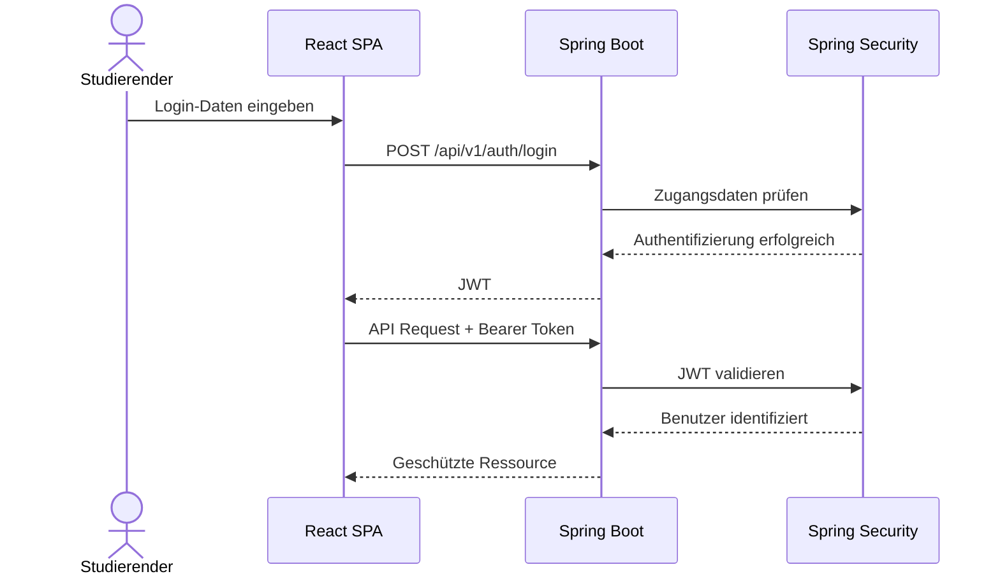

# 8 — Querschnittliche Konzepte

Querschnittliche Konzepte beschreiben technische und organisatorische Lösungen, die mehrere Teile der Architektur gleichzeitig betreffen.

Im Study Planer betreffen insbesondere Authentifizierung, Fehlerbehandlung, Logging, Datenbankzugriff, Konfiguration, Typenkonsistenz und Tests mehrere Architekturbausteine.

---

## 8.1 Authentifizierung und Autorisierung

Der Study Planer verwendet eine JWT-basierte, zustandslose Authentifizierung.

Nach einer erfolgreichen Anmeldung stellt das Backend ein signiertes JWT aus. Dieses Token wird bei geschützten API-Anfragen vom Frontend als Bearer Token übertragen.

Der grundlegende Ablauf ist:



Das JWT wird vom Backend signiert und besitzt eine Ablaufzeit von 24 Stunden.

Alle API-Endpunkte außer den Authentifizierungs-Endpunkten unter `/auth/*` benötigen einen gültigen JWT.

Zusätzlich zur Authentifizierung wird eine Ownership-Prüfung durchgeführt. Dabei wird die Benutzer-ID aus dem JWT mit dem Eigentümer der angeforderten Ressource verglichen.

Dadurch wird verhindert, dass ein Studierender auf Aufgaben eines anderen Benutzers zugreift.

Die entsprechenden Anforderungen sind in N1.2 und N2.1 beschrieben.

---

## 8.2 Fehlerbehandlung

Fehler werden im Backend zentral behandelt.

Ein globaler `@ControllerAdvice` verarbeitet unbehandelte Exceptions und erzeugt ein einheitliches JSON-Format für Fehlerantworten.

```json
{
  "status": 400,
  "error": "Bad Request",
  "message": "Titel darf nicht leer sein",
  "timestamp": "2025-01-21T10:00:00Z"
}
```

Verwendete HTTP-Statuscodes:

| Status | Bedeutung |
|--------|-----------|
| 400 | Ungültige oder fehlerhafte Eingabe |
| 401 | Nicht authentifiziert |
| 403 | Zugriff auf fremde Ressource |
| 404 | Ressource nicht gefunden |
| 500 | Interner Serverfehler |

Das Frontend verarbeitet API-Fehler zentral.

Bei einem HTTP-401-Fehler wird der Benutzer zur Login-Seite weitergeleitet. Andere API-Fehler werden über einen zentralen Error-State als Toast oder Inline-Meldung dargestellt.

Dadurch sollen fehlgeschlagene Requests nicht zu leeren oder unbedienbaren Ansichten führen.

---

## 8.3 Logging

Das Backend verwendet das Logging-Framework SLF4J mit Logback.

Im Normalbetrieb wird das Log-Level `INFO` verwendet. Für die Entwicklung kann zusätzlich ein `DEBUG`-Level über ein entsprechendes Spring-Profil aktiviert werden.

Personenbezogene oder sicherheitsrelevante Informationen werden nicht in Logs geschrieben.

Insbesondere dürfen folgende Informationen nicht protokolliert werden:

- Passwörter
- JWT-Secrets
- API-Keys
- vollständige Zugangsdaten

Fehler im Scheduler werden auf dem Level `ERROR` protokolliert.

Ein Fehler bei der Verarbeitung eines einzelnen Reminders darf den normalen Betrieb der Anwendung nicht beenden.

---

## 8.4 Datenbankzugriff und Persistenz

Der Zugriff auf PostgreSQL erfolgt über Spring Data JPA und Hibernate.

Repositories werden als `JpaRepository`-Interfaces umgesetzt.

Die Anwendung verwendet eine Schichtenstruktur:

```text
Controller
    ↓
Service
    ↓
Repository
    ↓
PostgreSQL
```

Die Service-Schicht enthält die fachliche Verarbeitung und steuert Transaktionen.

Methoden, die mehrere Datenbankoperationen kombinieren, werden mit `@Transactional` abgesichert.

Native SQL-Abfragen werden nur eingesetzt, wenn eine benötigte Abfrage nicht sinnvoll über JPA umgesetzt werden kann.

Die Datenbankstruktur wird über Flyway-Migrationen verwaltet.

Die Migrationen werden unter folgendem Pfad abgelegt:

`backend/src/main/resources/db/migration/V*.sql`

Die in D2 definierten Enum-Typen werden im Backend als Java-Enums umgesetzt und mit `@Enumerated(EnumType.STRING)` gespeichert.

---

## 8.5 Konfigurationsmanagement

Umgebungsabhängige und sensible Konfigurationswerte werden nicht direkt im Quellcode hinterlegt.

Dazu gehören insbesondere:

- Datenbankpasswort
- JWT-Secret
- SMTP-Host
- SMTP-Port
- SMTP-Benutzer
- SMTP-Passwort

Diese Werte werden über Umgebungsvariablen bereitgestellt.

Eine `.env.example` dient als Vorlage für die lokale Konfiguration.

Die tatsächliche `.env`-Datei wird nicht in das Repository eingecheckt.

Das Docker-Compose-Setup kann die Werte aus der `.env`-Datei übernehmen.

Damit werden die Anforderungen aus CON-06 und NFR-12-04 umgesetzt.

---

## 8.6 API-Versionierung

Die REST-API verwendet eine URL-basierte Versionierung.

Der aktuelle API-Präfix lautet:

`/api/v1`

Beispielsweise:

`GET /api/v1/tasks`

Der Präfix wird zentral über die Backend-Konfiguration definiert.

Änderungen, die nicht rückwärtskompatibel sind, sollen über eine neue API-Version bereitgestellt werden.

Dadurch können unterschiedliche API-Versionen bei zukünftigen Erweiterungen voneinander getrennt werden.

---

## 8.7 Typenkonsistenz

Die im Datenmodell definierten Typen werden zwischen Spezifikation, Backend und Frontend konsistent verwendet.

Beispielsweise werden folgende Typen in allen relevanten Schichten mit identischer fachlicher Bedeutung verwendet:

| Spezifikation | Backend | Frontend |
|---------------|---------|----------|
| `TaskType` | `TaskType` | `TaskType` |
| `TaskStatus` | `TaskStatus` | `TaskStatus` |
| `ReminderChannel` | `ReminderChannel` | `ReminderChannel` |
| `UrgencyLevel` | `UrgencyLevel` | `UrgencyLevel` |
| `TaskDTO` | `TaskDTO` | `TaskDTO` |
| `CreateTaskRequest` | `CreateTaskRequest` | `CreateTaskRequest` |
| `LearningPlanDTO` | `LearningPlanDTO` | `LearningPlanDTO` |

Insbesondere `UrgencyLevel` wird nicht in der Datenbank gespeichert.

Der Wert wird serverseitig anhand der Deadline und des aktuellen Datums berechnet und als Bestandteil des `TaskDTO` an das Frontend übertragen.

Damit soll sichergestellt werden, dass die Begriffe und Datenstrukturen aus der Spezifikation im implementierten System wiedererkennbar bleiben.

---

## 8.8 Validierung

Eingaben werden sowohl auf Client- als auch auf Serverseite validiert.

Das Frontend prüft Eingaben möglichst direkt am Formularfeld, bevor ein API-Aufruf durchgeführt wird.

Das Backend validiert die eingehenden Requests zusätzlich, da Client-seitige Validierung nicht als Sicherheitsmechanismus ausreicht.

Beispiele für zu validierende Werte sind:

- Pflichtfelder wie Titel und Deadline
- Fortschritt zwischen 0 und 100 Prozent
- positive Dauer einer Lernsession
- Prioritätsgewichtung innerhalb des vorgesehenen Wertebereichs

Ungültige Eingaben werden mit einer verständlichen Fehlermeldung und HTTP 400 zurückgegeben.

---

## 8.9 Sicherheitskonzept

Sicherheitsrelevante Anforderungen werden über mehrere Querschnittskonzepte umgesetzt.

Dazu gehören:

- JWT-basierte Authentifizierung
- Ownership-Prüfung
- sichere Passwortspeicherung mit bcrypt
- keine Secrets im Repository
- keine Passwörter in Logs
- zentrale Fehlerbehandlung
- serverseitige Validierung
- HTTPS für produktive Kommunikation
- kontrollierter Zugriff auf Datenbankressourcen

Passwörter werden ausschließlich als bcrypt-Hash gespeichert.

Ein Passwort darf niemals im Klartext in der Datenbank gespeichert oder an den Client zurückgegeben werden.

---

## 8.10 Testkonzept

Die Architektur sieht Tests auf mehreren Ebenen vor.

| Schicht | Testart | Werkzeug |
|---------|---------|----------|
| Service-Schicht | Unit-Tests | JUnit 5 + Mockito |
| Controller-Schicht | Integrationstests | Spring MockMvc |
| Frontend | Komponenten-Tests | Vitest + Testing Library |
| Gesamtsystem | Manuelle Tests | Browser |

Die fachlichen Funktionen der Service-Schicht sollen insbesondere unabhängig von externen Komponenten getestet werden können.

Für die Use Cases UC-01 bis UC-11 sind manuelle Tests anhand der jeweiligen Akzeptanzkriterien vorgesehen.

Das definierte Ziel für die Service-Schicht beträgt mindestens 60 % Line Coverage.

---

## 8.11 Responsive Benutzeroberfläche

Die Benutzeroberfläche wird als responsive Webanwendung umgesetzt.

Die Anwendung soll sowohl auf Desktop-Geräten als auch auf mobilen Endgeräten nutzbar sein.

Vorgesehene Mindestbreiten:

- Desktop: 1024 px
- Mobilgerät: 375 px

Die Darstellung wird über responsive CSS-Techniken wie Flexbox und Grid angepasst.

---

## 8.12 Barrierearme Darstellung

Die Benutzeroberfläche berücksichtigt die Anforderungen an ausreichende Farbkontraste.

Für normale Texte wird ein Kontrastverhältnis von mindestens 4,5:1 angestrebt.

Dies betrifft insbesondere die Ampeldarstellung des `UrgencyLevel`:

- `RED`
- `YELLOW`
- `GREEN`

Die Farbe allein soll nicht die einzige Information sein, anhand derer die Dringlichkeit einer Aufgabe erkannt werden kann.

---

## 8.13 Querschnittliche Beziehung zur Spezifikation

Die in diesem Kapitel beschriebenen Konzepte werden von mehreren Architekturbausteinen verwendet.

| Konzept | Betroffene Bereiche |
|---------|---------------------|
| Authentifizierung | Auth, Controller, Service, Frontend |
| Ownership | Task-Verwaltung, Fortschritt, Lernplan |
| Fehlerbehandlung | Controller, Frontend |
| Logging | Backend, Scheduler |
| Datenbankzugriff | Services, Repositories, Entitäten |
| Konfiguration | Backend, Docker Compose, SMTP |
| Typenkonsistenz | Backend, Frontend, API |
| Validierung | Frontend, Controller, Service |
| Testing | Backend, Frontend, Use Cases |

Die detaillierten Anforderungen und Vorgaben zu diesen Konzepten sind in N2 der Spezifikation beschrieben.

Die konkreten Technologieentscheidungen und deren Begründung werden in Kapitel 9 — Architekturentscheidungen — dokumentiert.