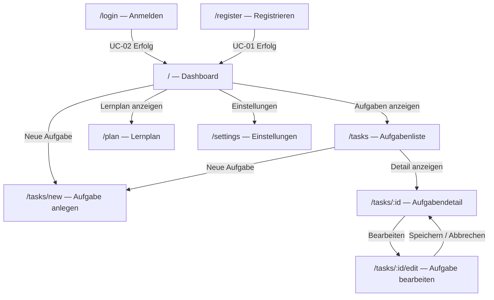

# B1 — Dialogspezifikation

B1 beschreibt die Benutzerschnittstelle: Navigationsstruktur, Screens und ihre Elemente. B1 ist die UI-seitige Konkretisierung der Use Cases aus F2. Jeder UC hat mindestens einen Screen.

---

## B1.1 Navigationsstruktur



Alle Routen außer `/login` und `/register` erfordern eine aktive Sitzung. Unauthentifizierte Zugriffe werden auf `/login` umgeleitet.

---

## B1.2 Screens

### S-01 — Anmelden (`/login`)

**Realisiert:** UC-02

| Element | Typ | Pflicht | Validierung |
|---------|-----|---------|-------------|
| E-Mail-Adresse | Eingabefeld (`type="email"`) | Ja | E-Mail-Format |
| Passwort | Eingabefeld (`type="password"`) | Ja | — |
| Anmelden | Primärbutton | — | — |
| Registrieren-Link | Textlink → `/register` | — | — |
| Fehlermeldung | Inline-Text (rot, unter Formular) | — | Angezeigt bei falschen Credentials |

**Verhalten:** Bei Erfolg → Weiterleitung auf `/`. Bei Fehler → Fehlermeldung unter Formular; kein Seitenreload; Passwortfeld geleert.

---

### S-02 — Registrieren (`/register`)

**Realisiert:** UC-01

| Element | Typ | Pflicht | Validierung |
|---------|-----|---------|-------------|
| Benutzername | Eingabefeld (`type="text"`) | Ja | 2–100 Zeichen |
| E-Mail-Adresse | Eingabefeld (`type="email"`) | Ja | RFC 5322-Format |
| Passwort | Eingabefeld (`type="password"`) | Ja | ≥ 8 Zeichen |
| Passwort bestätigen | Eingabefeld (`type="password"`) | Ja | Muss mit Passwort übereinstimmen |
| Registrieren | Primärbutton | — | — |
| Anmelden-Link | Textlink → `/login` | — | — |

**Verhalten:** Validierungsfehler werden direkt am jeweiligen Feld angezeigt (NFR-15-02). Bei Erfolg → Weiterleitung auf `/`.

---

### S-03 — Dashboard (`/`)

**Realisiert:** UC-07

**Layout:**

```
┌──────────────────────────────────────────────────┐
│  Study Planer          [Benutzername]  [Abmelden]│
├──────────────────────────────────────────────────┤
│  Guten Morgen, [Name]!  ·  3 Aufgaben diese Woche│
│                                                  │
│  ┌─────────────────┐  ┌─────────────────┐        │
│  │ 🔴 Mathematik   │  │ 🟡 Englisch     │        │
│  │ Klausur · morgen│  │ Abgabe · 5 Tage │        │
│  │ ████████░░  80 %│  │ ████░░░░░░  40 %│        │
│  └─────────────────┘  └─────────────────┘        │
│                                                  │
│  ┌─────────────────┐  ┌─────────────────┐        │
│  │ 🟢 Algorithmen  │  │  + Neue Aufgabe │        │
│  │ Prüfung · 14 T. │  │                 │        │
│  │ ██░░░░░░░░  20 %│  │                 │        │
│  └─────────────────┘  └─────────────────┘        │
└──────────────────────────────────────────────────┘
```

| Element | Beschreibung |
|---------|-------------|
| Aufgabenkarten | Je Aufgabe: Titel, Typ-Badge, Deadline-Countdown, Fortschrittsbalken, Ampelfarbe (AF-02). |
| Ampelfarbe | 🔴 RED (≤ 3 Tage) · 🟡 YELLOW (≤ 7 Tage) · 🟢 GREEN (> 7 Tage). |
| Neue-Aufgabe-Karte | Shortcut → `/tasks/new`. |
| Wochenzähler | „X Aufgaben diese Woche" — Aufgaben mit Deadline in den nächsten 7 Tagen. |
| Navigation | Sidebar (Desktop) oder Bottom-Navigation (Mobile). |

**Qualitäten:** NFR-11-01 (Ladezeit < 2 s); NFR-15-01 (Responsive).

---

### S-04 — Aufgabe anlegen / bearbeiten (`/tasks/new`, `/tasks/:id/edit`)

**Realisiert:** UC-04, UC-05

| Element | Typ | Sichtbar bei | Pflicht |
|---------|-----|-------------|---------|
| Aufgabentyp | Tabs / Radio (EXAM / ASSIGNMENT / GOAL) | Immer | Ja |
| Titel | Eingabefeld | Immer | Ja |
| Fach / Modul | Eingabefeld | Immer | Nein |
| Deadline | Datepicker | Immer | Ja |
| Beschreibung | Textarea | Immer | Nein |
| Geschätzter Aufwand (h) | Zahlenfeld | Immer | Nein |
| Gewichtung (1–10) | Schieberegler | EXAM | Nein |
| Unteraufgaben | Dynamische Liste (hinzufügen / abhaken) | GOAL | Nein |
| Speichern | Primärbutton | Immer | — |
| Abbrechen | Textlink → Aufgabenliste | Immer | — |

**Verhalten:** Beim Bearbeiten wird das Formular mit bestehenden Werten befüllt. Validierungsfehler erscheinen inline am Feld (NFR-15-02). Datum in der Vergangenheit → Warnung, aber kein hartes Verbot.

---

### S-05 — Aufgabendetail (`/tasks/:id`)

**Realisiert:** UC-09 (Fortschritt eintragen), UC-06 (Löschen), Navigation zu UC-05

| Element | Beschreibung |
|---------|-------------|
| Aufgabentitel + Typ-Badge | Prominent oben. |
| Deadline-Countdown | „in X Tagen" mit Ampelfarbe. |
| Fortschrittsbalken + Prozentzahl | Aktueller Stand. |
| Fortschritts-Schieberegler | 0–100 %; Speichern-Button daneben. |
| Lernsession eintragen | Felder: Dauer (Minuten), Notiz; Speichern-Button. |
| Lernhistorie | Liste bisheriger Sessions (Datum, Dauer, Notiz). |
| Bearbeiten-Button | → `/tasks/:id/edit`. |
| Löschen-Button | Öffnet Bestätigungs-Modal (UC-06). |

---

### S-06 — Lernplan (`/plan`)

**Realisiert:** UC-08

| Element | Beschreibung |
|---------|-------------|
| Wochennavigation | ← Zurück / Weiter → Buttons; aktuelle KW angezeigt. |
| Tagesspalten (Mo–So) | Je Spalte: Datum, empfohlene Aufgaben als Chips. |
| Aufgaben-Chip | Titel, empfohlene Minuten, Ampelfarbe. |
| Plan neu berechnen | Button → `POST /api/v1/plan/recalculate`. |

---

### S-07 — Einstellungen (`/settings`)

**Realisiert:** UC-10 (Erinnerungen), UC-11 (Export)

| Abschnitt | Elemente |
|-----------|---------|
| Profil | Benutzername ändern; Passwort ändern. |
| Erinnerungen | Standard-Vorlaufzeit (Tage); Kanal-Auswahl (ReminderChannel: IN_APP / EMAIL / BOTH); Hinweis wenn SMTP nicht konfiguriert. |
| Export | Button „Alle Aufgaben als .ics exportieren" → UC-11. |
| Abmelden | Button → UC-03. |

---

## B1.3 Querverweise

| Baustein | Relevanz |
|----------|---------|
| F2 | Jeder Screen realisiert mindestens einen UC aus F2; Mapping in B1.2 je Screen angegeben. |
| D2 | `UrgencyLevel` steuert Ampelfarben (S-03, S-05, S-06); `TaskType` steuert sichtbare Felder in S-04. |
| N1 | NFR-11-01 (Dashboard-Ladezeit); NFR-15-01 (Responsive); NFR-15-02 (Inline-Validierung); NFR-15-03 (Kontrast). |
