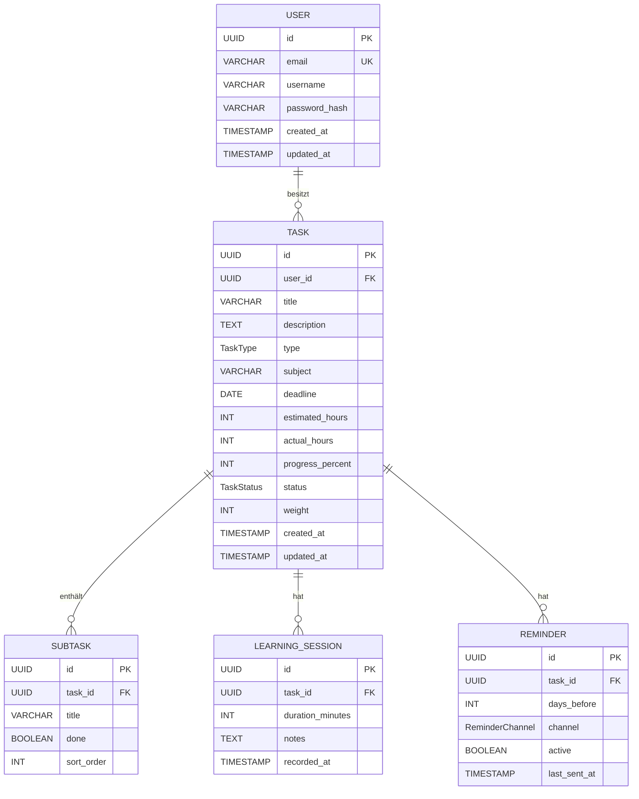

# D1 — Datenmodell

D1 beschreibt die persistierten Entitäten, ihre Attribute, Beziehungen und Invarianten. Die Typen der Attribute sind in D2 definiert. Entitätsnamen und Attributnamen sind verbindlich — sie werden in D2, S1, im Datenbankschema und im Code identisch verwendet.

---

## D1.1 Entity-Relationship-Diagramm



---

## D1.2 Entitätsbeschreibungen

### USER

Repräsentiert einen registrierten Studierenden.

| Attribut | Typ | Constraint | Beschreibung |
|----------|-----|------------|--------------|
| `id` | UUID | PK, NOT NULL | Primärschlüssel (UUID v4, serverseitig generiert). |
| `email` | VARCHAR(255) | UNIQUE, NOT NULL | Login-Identifier; unveränderlich nach Registrierung (MVP). |
| `username` | VARCHAR(100) | NOT NULL | Anzeigename; änderbar in UC-Einstellungen. |
| `password_hash` | VARCHAR(60) | NOT NULL | bcrypt-Hash (60 Zeichen, Kostenfaktor 12). Niemals im Klartext. |
| `created_at` | TIMESTAMP | NOT NULL, DEFAULT NOW() | Erstellungszeitpunkt. |
| `updated_at` | TIMESTAMP | NOT NULL | Letzte Änderung; automatisch aktualisiert. |

**Invarianten:** Ein USER-Datensatz kann nur über UC-01 angelegt werden. Passwort-Hash wird niemals an den Client übermittelt.

---

### TASK

Zentrale Entität; repräsentiert eine Prüfung, Abgabe oder ein Lernziel.

| Attribut | Typ | Constraint | Beschreibung |
|----------|-----|------------|--------------|
| `id` | UUID | PK, NOT NULL | Primärschlüssel. |
| `user_id` | UUID | FK → USER, NOT NULL | Eigentümer; Ownership-Prüfung via AF-07. |
| `title` | VARCHAR(255) | NOT NULL | Bezeichnung; Pflichtfeld. |
| `description` | TEXT | NULLABLE | Optionale Beschreibung; max. 5000 Zeichen. |
| `type` | TaskType | NOT NULL | `EXAM` / `ASSIGNMENT` / `GOAL` (D2). |
| `subject` | VARCHAR(100) | NULLABLE | Fach oder Modul. |
| `deadline` | DATE | NOT NULL | Fälligkeitsdatum (ISO 8601). |
| `estimated_hours` | INTEGER | DEFAULT 0, ≥ 0 | Geschätzter Gesamtaufwand; Fallback 1 h in AF-01. |
| `actual_hours` | INTEGER | DEFAULT 0, ≥ 0 | Summe aller `LEARNING_SESSION.duration_minutes / 60`. |
| `progress_percent` | INTEGER | DEFAULT 0, 0–100 | Fortschritt; steuert `status` via AF-03. |
| `status` | TaskStatus | NOT NULL, DEFAULT OPEN | Abgeleitet aus `progress_percent` (AF-03); nicht direkt setzbar. |
| `weight` | INTEGER | DEFAULT 1, 1–10 | Prioritätsgewichtung für AF-01. |
| `created_at` | TIMESTAMP | NOT NULL | Erstellungszeitpunkt. |
| `updated_at` | TIMESTAMP | NOT NULL | Letzte Änderung. |

**Invarianten:** `status` wird ausschließlich durch AF-03 gesetzt. `actual_hours` wird durch AF-09 aktualisiert, niemals direkt vom Client. Nur der Eigentümer (`user_id`) darf eine TASK lesen oder ändern (AF-07).

---

### SUBTASK

Unteraufgabe innerhalb einer TASK; sinnvoll primär für Typ `GOAL`.

| Attribut | Typ | Constraint | Beschreibung |
|----------|-----|------------|--------------|
| `id` | UUID | PK | Primärschlüssel. |
| `task_id` | UUID | FK → TASK, NOT NULL | Übergeordnete Aufgabe. |
| `title` | VARCHAR(255) | NOT NULL | Bezeichnung der Unteraufgabe. |
| `done` | BOOLEAN | DEFAULT FALSE | Erledigt? |
| `sort_order` | INTEGER | DEFAULT 0 | Anzeigereihenfolge (aufsteigend). |

---

### LEARNING_SESSION

Protokolleintrag einer Lernsession.

| Attribut | Typ | Constraint | Beschreibung |
|----------|-----|------------|--------------|
| `id` | UUID | PK | Primärschlüssel. |
| `task_id` | UUID | FK → TASK, NOT NULL | Zugehörige Aufgabe. |
| `duration_minutes` | INTEGER | NOT NULL, > 0 | Lerndauer in Minuten. |
| `notes` | TEXT | NULLABLE | Optionale Notiz zur Session. |
| `recorded_at` | TIMESTAMP | DEFAULT NOW() | Zeitpunkt der Erfassung. |

**Invarianten:** `TASK.actual_hours` wird nach jeder INSERT-Operation auf LEARNING_SESSION neu summiert (AF-09). LEARNING_SESSION-Einträge werden beim Löschen der übergeordneten TASK kaskadierend gelöscht.

---

### REMINDER

Erinnerungsregel je Aufgabe.

| Attribut | Typ | Constraint | Beschreibung |
|----------|-----|------------|--------------|
| `id` | UUID | PK | Primärschlüssel. |
| `task_id` | UUID | FK → TASK, NOT NULL | Betroffene Aufgabe. |
| `days_before` | INTEGER | NOT NULL, ≥ 1 | Vorlaufzeit in Tagen vor Deadline. |
| `channel` | ReminderChannel | NOT NULL | `IN_APP` / `EMAIL` / `BOTH` (D2). |
| `active` | BOOLEAN | DEFAULT TRUE | Inaktive Reminder werden von AF-10 ignoriert. |
| `last_sent_at` | TIMESTAMP | NULLABLE | Letzter Versandzeitpunkt; verhindert Doppel-Versand. |

---

## D1.3 Beziehungen

| Von | Zu | Kardinalität | Kaskadenregel |
|-----|-----|-------------|--------------|
| USER | TASK | 1 : n | DELETE USER → DELETE TASK (Cascade) |
| TASK | SUBTASK | 1 : n | DELETE TASK → DELETE SUBTASK (Cascade) |
| TASK | LEARNING_SESSION | 1 : n | DELETE TASK → DELETE LEARNING_SESSION (Cascade) |
| TASK | REMINDER | 1 : n | DELETE TASK → DELETE REMINDER (Cascade) |

---

## D1.4 Indizes

```sql
CREATE INDEX idx_task_user_id    ON task(user_id);
CREATE INDEX idx_task_deadline   ON task(deadline);
CREATE INDEX idx_task_status     ON task(status);
CREATE INDEX idx_ls_task_id      ON learning_session(task_id);
CREATE INDEX idx_reminder_task   ON reminder(task_id);
```
