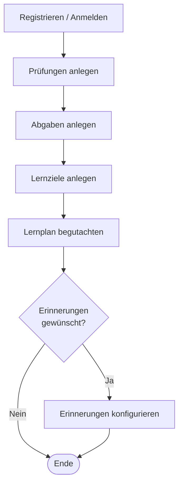
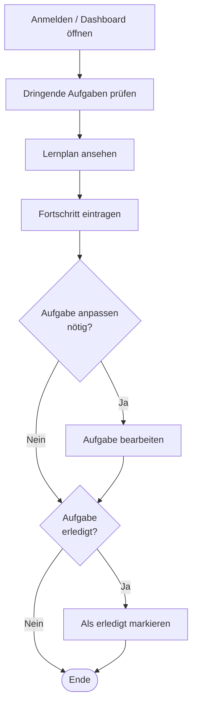
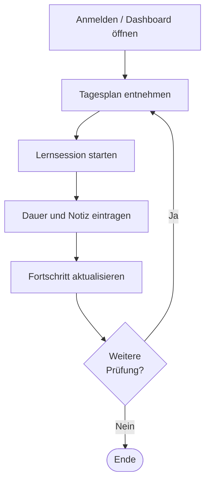

# F1 — Geschäftsprozesse

F1 beschreibt die zentralen Abläufe aus Nutzerperspektive — unabhängig von technischer Realisierung. Die Bausteine F2 und F3 verfeinern den systemunterstützten Teil dieser Prozesse.

---

## F1.1 Prozessübersicht

| ID | Prozess | Auslöser | Ergebnis |
|----|---------|---------|---------|
| GP-01 | Semester einrichten | Beginn eines neuen Semesters | Alle Aufgaben erfasst; initialer Lernplan erstellt |
| GP-02 | Laufende Planung und Verfolgung | Wöchentliche Nutzung | Fortschritt aktuell; Plan angepasst |
| GP-03 | Prüfungsphase | Verdichtete Lernphase vor Prüfungen | Tagesplan; Lernzeit protokolliert |

---

## F1.2 GP-01 — Semester einrichten

**Ziel:** Der Studierende legt alle relevanten Prüfungen, Abgaben und Lernziele für das neue Semester an und erhält einen ersten Lernplan.

**Akteur:** Studierender.

**Vorbedingung:** Nutzerkonto existiert oder wird im Prozess angelegt.

**Ablauf:**

| Schritt | Aktivität | Systemunterstützung |
|---------|-----------|-------------------|
| A1 | Registrieren oder Anmelden | UC-01 / UC-02 |
| A2 | Prüfungen anlegen (Titel, Datum, Fach, geschätzter Aufwand) | UC-04 |
| A3 | Abgaben anlegen (Titel, Deadline, Fach) | UC-04 |
| A4 | Lernziele anlegen (Thema, Zieldatum, Unteraufgaben) | UC-04 |
| A5 | Lernplan begutachten | UC-08 |
| A6 | Optional: Erinnerungen konfigurieren | UC-10 |

**Nachbedingung:** Alle Aufgaben erfasst; Lernplan berechnet und einsehbar.

---

## F1.3 GP-02 — Laufende Planung und Verfolgung

**Ziel:** Wöchentliche Überprüfung und Aktualisierung des Lernplans; Fortschritt wird eingetragen.

**Akteur:** Studierender.

**Vorbedingung:** Semester mit mindestens einer Aufgabe ist eingerichtet.

**Ablauf:**

| Schritt | Aktivität | Systemunterstützung |
|---------|-----------|-------------------|
| A1 | Anmelden und Dashboard öffnen | UC-02, UC-07 |
| A2 | Dringende Aufgaben identifizieren (Ampelfarben) | UC-07 |
| A3 | Aktuellen Lernplan ansehen | UC-08 |
| A4 | Lernfortschritt eintragen | UC-09 |
| A5 | Bei Bedarf: Aufgabe anpassen (Datum, Aufwand) | UC-05 |
| A6 | Abgeschlossene Aufgaben als erledigt markieren (100 %) | UC-09 |

**Nachbedingung:** Fortschritt persistiert; Lernplan aktuell.

**Häufigkeit:** Wöchentlich bis täglich, je nach Prüfungsnähe.

---

## F1.4 GP-03 — Prüfungsphase

**Ziel:** Intensive Nutzung in der Lernphase; tagesgenaue Planung; Lernzeit wird protokolliert.

**Akteur:** Studierender.

**Vorbedingung:** Prüfungen mit Datum und geschätztem Aufwand sind erfasst.

**Ablauf:**

| Schritt | Aktivität | Systemunterstützung |
|---------|-----------|-------------------|
| A1 | Anmelden; Dashboard zeigt rote Aufgaben prominent | UC-02, UC-07 |
| A2 | Tagesplan aus Lernplan entnehmen | UC-08 |
| A3 | Lernsession starten (Thema, geplante Dauer) | — (außerhalb System) |
| A4 | Nach Session: Dauer und Notiz eintragen | UC-09 |
| A5 | Fortschritt aktualisieren | UC-09 |
| A6 | Plan betrachten; nächste Prüfung priorisieren | UC-08 |

**Nachbedingung:** Lernzeit und Fortschritt gespeichert; Plan an tatsächlichen Stand angepasst.

---

## F1.5 Außerhalb des Scope

Die folgenden Aktivitäten sind Teil des studentischen Alltags, werden aber **nicht** vom Study Planer unterstützt:

| Aktivität | Grund |
|-----------|-------|
| Prüfungsanmeldung | Institutionell; außerhalb des Systemscopes (P1, NG-04) |
| Notenerfassung | Außerhalb des Problemraums (P1, NG-04) |
| Kommunikation mit Kommilitonen | Kein soziales Feature (P1, NG-03) |
| Beschaffung von Lernmaterialien | Kein LMS (P1, NG-02) |
