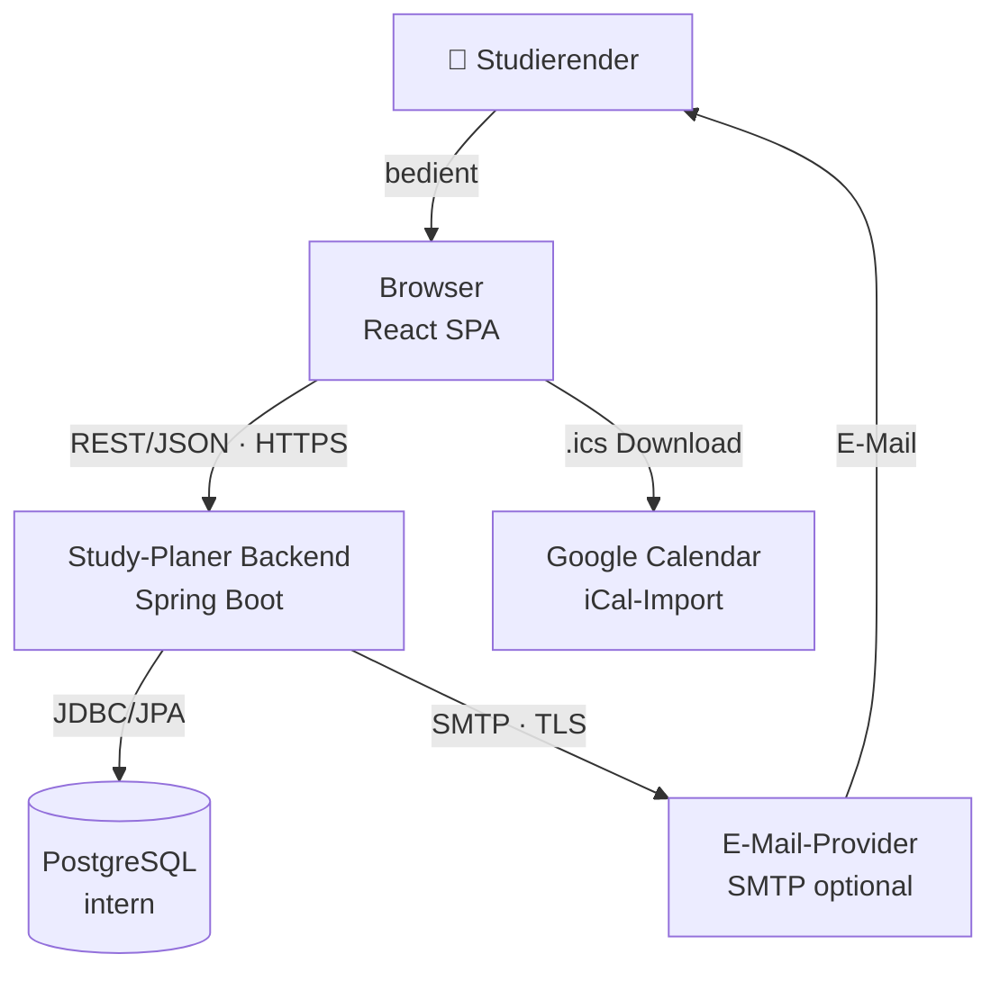

# P2 — Architekturüberblick

P2 beschreibt was der Study Planer ist und welche externen Systeme damit zusammenarbeiten. Die detaillierte technische Architekturbeschreibung findet sich in `docs/arch/`.

---

## P2.1 Systemkontext

Der Study Planer ist eine webbasierte Anwendung für Studierende. Der Nutzer erfasst Prüfungen, Abgaben und Lernziele — das System berechnet daraus automatisch einen priorisierten Lernplan.

---

## P2.2 Externe Schnittstellen (Überblick)

Die externen Schnittstellen des Study Planers sind der E-Mail-Provider für Erinnerungen und die Kalender-App für den .ics-Export. Details dazu in S1.
