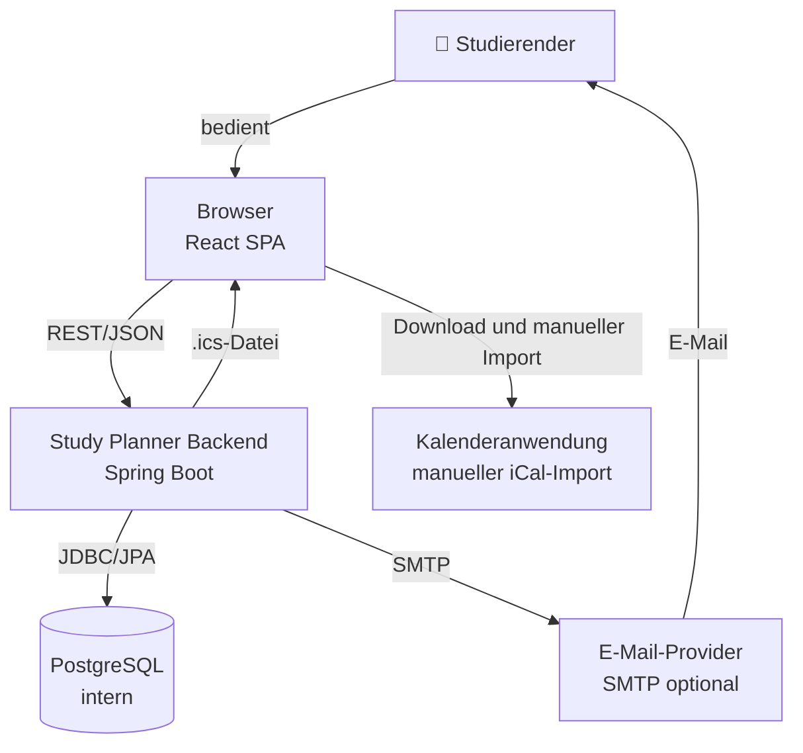

# P2 — Architekturüberblick

P2 beschreibt, was der Study Planner ist und welche externen Systeme damit zusammenarbeiten. Die detaillierte technische Architekturbeschreibung findet sich in `arch/`.

---

## P2.1 Systemkontext

Der Study Planner ist eine webbasierte Anwendung für Studierende. Der Nutzer erfasst Prüfungen, Abgaben und Lernziele — das System berechnet daraus einen strukturierten Lernplan.

---

## P2.2 Externe Schnittstellen (Überblick)

Die externen Schnittstellen des Study Planners sind:

- ein optionaler E-Mail-Provider über SMTP für Erinnerungen,
- eine Kalenderanwendung für den manuellen Import der exportierten `.ics`-Datei.

Eine direkte Synchronisation mit einem externen Kalenderdienst ist nicht Bestandteil des Systems.

Details zu den REST-Schnittstellen finden sich in `S1 — REST-API`.