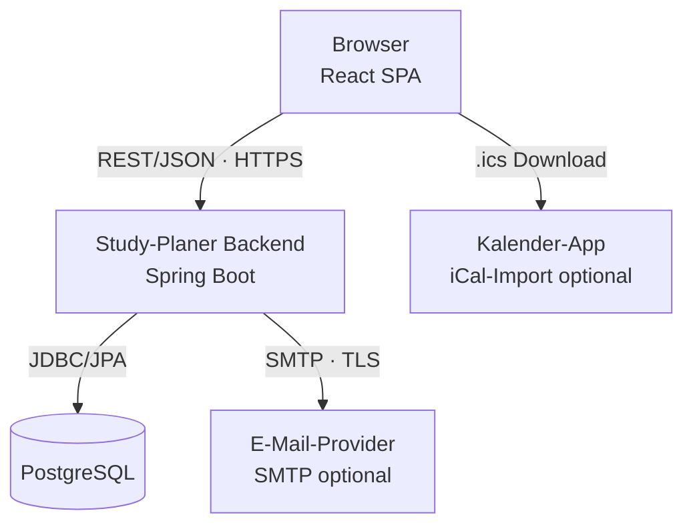

# S1 — Nachbarsysteme

S1 beschreibt alle Schnittstellen des Study Planers zu externen und internen Systemen: die REST-API zwischen Frontend und Backend sowie die optionalen Außenschnittstellen.

---

## S1.1 Systemkontext



---

## S1.2 REST-API (Frontend ↔ Backend)

**Basis-URL:** `http://localhost:8080/api/v1` (Entwicklung)

**Authentifizierung:** `Authorization: Bearer <JWT>` — außer bei `/auth/*`

**Content-Type:** `application/json`

**Versionierung:** URL-basiert (`/v1/`); Änderungen an der API erfordern eine neue Versionsnummer.

### S1.2.1 Authentifizierung

| Methode | Pfad | UC | Auth |
|---------|------|----|------|
| `POST` | `/auth/register` | UC-01 | Nein |
| `POST` | `/auth/login` | UC-02 | Nein |

**POST /auth/register — Request:**
```json
{
  "username": "max.mustermann",
  "email": "max@example.com",
  "password": "geheimesPasswort123"
}
```

**POST /auth/register — Response 201:**
```json
{
  "token": "<JWT>",
  "userId": "550e8400-e29b-41d4-a716-446655440000",
  "username": "max.mustermann"
}
```

**POST /auth/login — Request:**
```json
{
  "email": "max@example.com",
  "password": "geheimesPasswort123"
}
```

**POST /auth/login — Response 200:** Identisch mit Register-Response.

---

### S1.2.2 Aufgaben

| Methode | Pfad | UC | Auth |
|---------|------|----|------|
| `GET` | `/tasks` | UC-07 (Dashboard) | Ja |
| `POST` | `/tasks` | UC-04 | Ja |
| `GET` | `/tasks/{id}` | UC-05, UC-09 | Ja |
| `PUT` | `/tasks/{id}` | UC-05 | Ja |
| `DELETE` | `/tasks/{id}` | UC-06 | Ja |
| `PATCH` | `/tasks/{id}/progress` | UC-09 | Ja |

**GET /tasks — Response 200:** Array von `TaskDTO` (vgl. D2.3), sortiert nach `deadline` aufsteigend.

**POST /tasks — Request:** `CreateTaskRequest` (vgl. D2.3).

**POST /tasks — Response 201:** `TaskDTO` des neu angelegten Eintrags.

**PATCH /tasks/{id}/progress — Request:** `UpdateProgressRequest` (vgl. D2.3).

**PATCH /tasks/{id}/progress — Response 200:** Aktualisiertes `TaskDTO`.

---

### S1.2.3 Lernplan

| Methode | Pfad | UC | Auth |
|---------|------|----|------|
| `GET` | `/plan` | UC-08 | Ja |
| `POST` | `/plan/recalculate` | UC-08 | Ja |

**GET /plan — Response 200:** `LearningPlanDTO` (vgl. D2.3).

**POST /plan/recalculate — Response 200:** Neu berechnetes `LearningPlanDTO`.

---

### S1.2.4 Export

| Methode | Pfad | UC | Auth |
|---------|------|----|------|
| `GET` | `/export/ical` | UC-11 | Ja |

**Response:** `Content-Type: text/calendar`; `Content-Disposition: attachment; filename="study-planer.ics"`. Dateiinhalt: RFC-5545-konforme iCalendar-Datei.

**Verhalten bei 0 offenen Aufgaben:** Der Server gibt HTTP 200 mit einer validen, aber leeren `.ics`-Datei zurück (korrekter iCalendar-Header und -Footer, keine VEVENTs). Kein Fehler, kein leerer Bildschirm (NFR-13-02).

---

### S1.2.5 Fehlerantworten

Alle Fehler folgen einem einheitlichen Format (vgl. N2.2):

```json
{
  "status": 400,
  "error": "Bad Request",
  "message": "Titel darf nicht leer sein",
  "timestamp": "2025-01-21T10:00:00Z"
}
```

| HTTP-Status | Bedeutung | Auslöser |
|-------------|-----------|---------|
| 400 | Validierungsfehler | Ungültige Eingabe |
| 401 | Nicht authentifiziert | Kein oder ungültiger JWT |
| 403 | Zugriff verweigert | Fremde Ressource (AF-07) |
| 404 | Nicht gefunden | Ressource existiert nicht |
| 500 | Interner Serverfehler | Unbehandelte Exception |

---

## S1.3 PostgreSQL (intern)

| Eigenschaft | Wert |
|-------------|------|
| Protokoll | JDBC über Spring Data JPA / Hibernate |
| Host | `db` (Docker-Compose-Servicename) |
| Port | 5432 |
| Konfiguration | `POSTGRES_DB`, `POSTGRES_USER`, `POSTGRES_PASSWORD` via Umgebungsvariablen |
| Schema-Migration | Flyway beim Start automatisch |

PostgreSQL ist eine interne Komponente — kein Zugangspunkt für externe Systeme.

---

## S1.4 SMTP — E-Mail-Provider (optional)

| Eigenschaft | Wert |
|-------------|------|
| Protokoll | SMTP mit STARTTLS |
| Konfiguration | `SMTP_HOST`, `SMTP_PORT`, `SMTP_USER`, `SMTP_PASS` via `.env` |
| Verwendung | Erinnerungsversand durch AF-11; ausgelöst durch AF-10 (Scheduler) |
| Pflicht | Nein; fehlt `SMTP_HOST`, wird E-Mail-Kanal deaktiviert — kein Absturz (NFR-13-03) |

**Querverweise:** UC-10; AF-10; AF-11; NFR-12-04.

---

## S1.5 iCal-Export (Client-seitig)

| Eigenschaft | Wert |
|-------------|------|
| Standard | RFC 5545 (iCalendar) |
| Erzeugt durch | Backend (AF-12); Download per Browser |
| Inhalt | VEVENT je offener Aufgabe: DTSTART = deadline, SUMMARY = title, DESCRIPTION = description |
| Kompatibilität | Google Calendar, Apple Calendar, Mozilla Thunderbird |

**Querverweise:** UC-11; AF-12.
